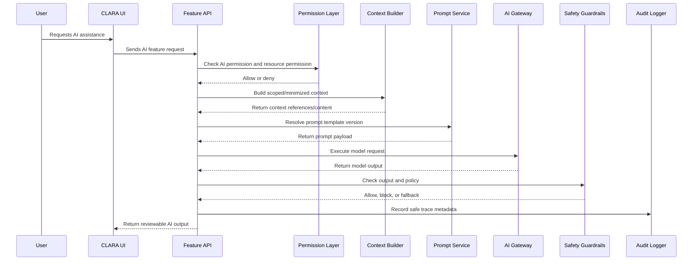

# Human Review Workflow Implementation

> *"Defines implementation plan for human review, edit, accept, reject, send, and feedback states for AI output."*

---

# Purpose

Defines implementation plan for human review, edit, accept, reject, send, and feedback states for AI output.

---

# Execution Problem

If review is bolted on as an afterthought, users may send unsafe output or lose traceability of decisions.

---

# Engineering Decision

## Decision

Human review must be a first-class workflow for customer-visible and sensitive AI outputs.

## Status

Accepted.

---

# AI Implementation Rule

Every AI feature must be designed as:

```text
User Intent -> AI Permission -> Resource Permission -> Scoped Context -> Prompt Template -> AI Gateway -> Safety Checks -> Human Review -> Audit/Feedback
```

Do not call model providers directly from UI.

Do not call model providers directly from random product services.

Do not allow AI to access data the actor cannot access.

---

# Recommended Flow



---

# Secure-by-Design Checklist

- [ ] AI feature permission is checked.
- [ ] Underlying resource permission is checked.
- [ ] Organization scope is enforced.
- [ ] Workspace scope is enforced.
- [ ] Context sources are explicit.
- [ ] Sensitive data is minimized or redacted.
- [ ] Prompt template version is recorded.
- [ ] Provider/model metadata is recorded safely.
- [ ] Output is labeled as AI-generated.
- [ ] Human review is required where customer-visible or sensitive.
- [ ] Audit event is emitted where required.
- [ ] Feedback path exists where practical.
- [ ] Cost/rate limit is considered.
- [ ] Failure fallback is safe.

---

# Acceptance Criteria

- [ ] Implementation direction is clear.
- [ ] AI behavior is aligned with Book IV.
- [ ] Security boundaries are explicit.
- [ ] Audit and traceability are considered.
- [ ] Human review behavior is defined.
- [ ] Testing expectations are included.
- [ ] AI coding assistants can follow this safely.

---

# Anti-patterns

Avoid:

- Direct AI provider calls from frontend.
- Direct AI provider calls from random product modules.
- AI context without permission checks.
- Sending full customer history by default.
- Storing full prompts/outputs without policy.
- Auto-sending AI replies.
- Letting AI execute destructive actions without approval.
- Treating AI output as verified truth.
- Logging secrets, tokens, hidden prompts, or private context.
- Expanding autonomy before evaluation and audit exist.

---

# Related Documents

- ../PART-03-Backend-Implementation-Plan/README.md
- ../PART-05-Database-and-Migration-Plan/README.md
- ../../BOOK-04-Product-Domain-Specification/PART-07-Knowledge-Base/README.md
- ../../BOOK-04-Product-Domain-Specification/PART-08-AI-Assistant-Product/README.md
- ../../BOOK-04-Product-Domain-Specification/BOOK-04-Master-Index/BOOK-04-AI-GOVERNANCE-MAP.md
- ../../BOOK-04-Product-Domain-Specification/BOOK-04-Master-Index/BOOK-04-PERMISSION-MAP.md

---

# Navigation

**Previous:** `95-AI-Tool-Actions-Implementation.md`

**Next:** `97-AI-Safety-Guardrails-Implementation.md`

---

# Human Review Data Model

Track:

```text
ai_output_id
reviewer_id
review_decision
edited_output_reference
sent_message_id if sent
rejection_reason optional
created_at
```

---

# Review Decisions

```text
accepted
edited
rejected
sent_by_human
expired
```

---

# Product Rule

For customer-visible AI output, human review is mandatory in MVP.
