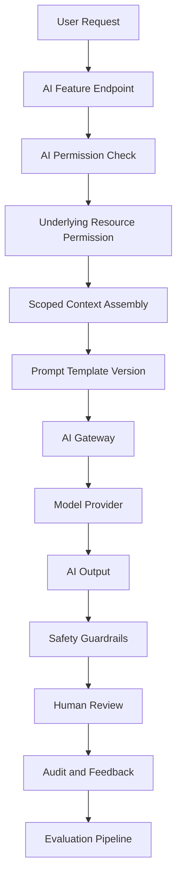

# PART-06 — AI Implementation Plan

> *"AI is not a shortcut around engineering discipline. AI is a product capability that needs stronger boundaries."*

---

# Purpose

Part 06 defines how CLARA AI should be implemented safely and consistently.

It covers:

- AI Gateway architecture.
- Model provider abstraction.
- Prompt template management.
- AI context assembly.
- Knowledge retrieval and RAG.
- AI reply drafting.
- AI summaries.
- AI classification and extraction.
- AI tool actions.
- Human review workflow.
- AI safety guardrails.
- AI permissions and scope enforcement.
- AI audit and traceability.
- Feedback and evaluation.
- Testing and red-team strategy.
- Cost, rate limit, and quota strategy.
- Privacy and data retention.
- Monitoring, fallback, and incident handling.

---

# Chapter Map

| Chapter | Title |
|---:|---|
| 86 | AI Implementation Plan Overview |
| 87 | AI Gateway Architecture |
| 88 | Model Provider Abstraction |
| 89 | Prompt Template Management |
| 90 | AI Context Assembly |
| 91 | Knowledge Retrieval and RAG Implementation |
| 92 | AI Reply Drafting Implementation |
| 93 | AI Summary Implementation |
| 94 | AI Classification and Extraction Implementation |
| 95 | AI Tool Actions Implementation |
| 96 | Human Review Workflow Implementation |
| 97 | AI Safety Guardrails Implementation |
| 98 | AI Permissions and Scope Enforcement |
| 99 | AI Audit and Traceability Implementation |
| 100 | AI Feedback and Evaluation Pipeline |
| 101 | AI Testing and Red Team Strategy |
| 102 | AI Cost Rate Limit and Quota Strategy |
| 103 | AI Privacy and Data Retention Strategy |
| 104 | AI Monitoring Fallback and Incident Handling |
| 105 | Part 06 Summary |

---

# AI Execution Map



---

# AI Non-Negotiables

CLARA AI implementation must enforce:

```text
No direct provider calls from random modules
No AI permission bypass
No cross-workspace context leakage
No auto-send customer replies in MVP
No hidden prompt exposure
No raw secrets in AI context
No draft/private knowledge as trusted grounding by default
No high-risk tool actions without approval
Safe AI audit metadata
Cost and rate-limit controls
Manual workflow fallback when AI fails
```

---

# MVP AI Scope

MVP AI should include:

```text
AI Gateway
One provider adapter
Versioned prompt templates
Scoped context builder
Knowledge-grounded reply drafting
Human review before send
Conversation summary optional
AI audit metadata
Basic feedback
Basic usage counters
Safe fallback states
```

MVP AI should defer:

```text
Autonomous agents
Unrestricted tool use
AI-created active workflows
Complex multi-step planning
Full custom prompt studio
Automatic customer-visible sending
```

---

# Navigation

**Previous:** `../PART-05-Database-and-Migration-Plan/85-Part-05-Summary.md`

**Next:** `86-AI-Implementation-Plan-Overview.md`
