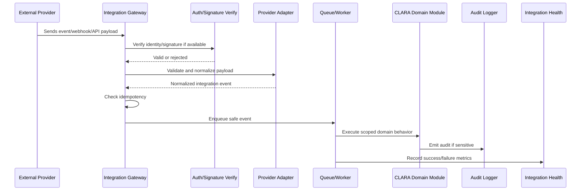

# Integration Implementation Plan Overview

> *"Defines the execution plan for implementing CLARA integrations, channels, connector lifecycle, webhooks, provider adapters, credentials, sync jobs, observability, and security controls."*

---

# Purpose

Defines the execution plan for implementing CLARA integrations, channels, connector lifecycle, webhooks, provider adapters, credentials, sync jobs, observability, and security controls.

---

# Execution Problem

Integrations are external trust boundaries. Without a clear implementation plan, CLARA can ingest malicious data, leak secrets, duplicate messages, lose events, or silently fail.

---

# Engineering Decision

## Decision

CLARA integrations should be implemented through a governed Integration Gateway with provider adapters, strict validation, idempotency, safe credential handling, retries, audit, and monitoring.

## Status

Accepted.

---

# Integration Implementation Rule

Every integration feature must be designed as:

```text
External Input / Output -> Provider Adapter -> Validation -> Idempotency -> Normalization -> Scoped Domain Action -> Audit / Logs / Metrics
```

Do not treat external payloads as trusted internal data.

Do not store raw secrets in normal tables.

Do not let integrations bypass tenant, workspace, permission, or entitlement boundaries.

---

# Recommended Flow



---

# Secure-by-Design Checklist

- [ ] Provider identity is verified where possible.
- [ ] Webhook signature is verified where supported.
- [ ] Payload schema is validated.
- [ ] Payload is normalized before domain use.
- [ ] Idempotency key or external event reference is checked.
- [ ] Organization/workspace scope is resolved safely.
- [ ] Credential values are not logged or returned.
- [ ] Provider-specific logic stays inside adapter.
- [ ] Retry behavior is safe and bounded.
- [ ] Failure is recorded and diagnosable.
- [ ] Sensitive integration actions are audited.
- [ ] Rate limits are considered.
- [ ] Tests cover invalid, duplicate, and unauthorized events.

---

# Acceptance Criteria

- [ ] Implementation direction is clear.
- [ ] External trust boundary is explicit.
- [ ] Credential behavior is safe.
- [ ] Idempotency behavior is defined.
- [ ] Retry/failure handling is included.
- [ ] Observability expectations are included.
- [ ] Security testing expectations are included.
- [ ] AI coding assistants can follow this safely.

---

# Anti-patterns

Avoid:

- Direct provider logic inside product modules.
- Trusting webhook payloads without validation.
- Ignoring signature verification.
- Processing duplicate provider events.
- Logging raw provider payloads with secrets/PII.
- Storing raw access tokens in visible config tables.
- Building many fragile integrations before one reliable channel.
- Using unofficial scraping as production-grade architecture.
- Allowing integration setup by low-privilege users.
- Hiding integration failures from admins.

---

# Related Documents

- ../PART-03-Backend-Implementation-Plan/README.md
- ../PART-05-Database-and-Migration-Plan/README.md
- ../PART-06-AI-Implementation-Plan/README.md
- ../../BOOK-04-Product-Domain-Specification/PART-10-Integrations-and-Channels/README.md
- ../../BOOK-04-Product-Domain-Specification/PART-09-Workflow-Automation/README.md
- ../../BOOK-04-Product-Domain-Specification/BOOK-04-Master-Index/BOOK-04-PERMISSION-MAP.md

---

# Navigation

**Previous:** `../PART-06-AI-Implementation-Plan/105-Part-06-Summary.md`

**Next:** `107-Integration-Gateway-Architecture.md`

---

# Integration MVP Build Order

Recommended order:

```text
1. Integration data model baseline
2. Integration Gateway interface
3. Provider adapter interface
4. Credential metadata and secret reference pattern
5. Web Chat or Custom API Channel
6. Inbound webhook/API ingestion validation
7. Idempotency and external references
8. Message normalization into Conversations
9. Integration health/status UI
10. Failure logging and retry baseline
```

---

# Early MVP Warning

Do not start with too many providers.

Start with one reliable channel that proves the integration architecture.
