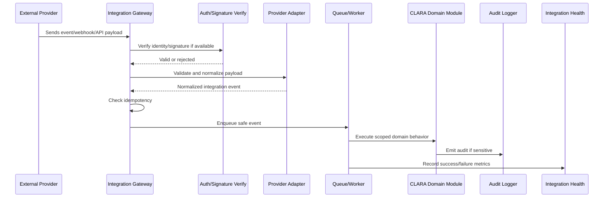

# Retry Dead Letter and Failure Handling

> *"Defines implementation plan for retries, dead-letter queues, provider failures, malformed payloads, and partial processing."*

---

# Purpose

Defines implementation plan for retries, dead-letter queues, provider failures, malformed payloads, and partial processing.

---

# Execution Problem

Provider outages and malformed events are normal in production. Without failure handling, messages and events can be lost silently.

---

# Engineering Decision

## Decision

Integration failures should fail safely, retry when safe, preserve failure records, and expose actionable diagnostics.

## Status

Accepted.

---

# Integration Implementation Rule

Every integration feature must be designed as:

```text
External Input / Output -> Provider Adapter -> Validation -> Idempotency -> Normalization -> Scoped Domain Action -> Audit / Logs / Metrics
```

Do not treat external payloads as trusted internal data.

Do not store raw secrets in normal tables.

Do not let integrations bypass tenant, workspace, permission, or entitlement boundaries.

---

# Recommended Flow



---

# Secure-by-Design Checklist

- [ ] Provider identity is verified where possible.
- [ ] Webhook signature is verified where supported.
- [ ] Payload schema is validated.
- [ ] Payload is normalized before domain use.
- [ ] Idempotency key or external event reference is checked.
- [ ] Organization/workspace scope is resolved safely.
- [ ] Credential values are not logged or returned.
- [ ] Provider-specific logic stays inside adapter.
- [ ] Retry behavior is safe and bounded.
- [ ] Failure is recorded and diagnosable.
- [ ] Sensitive integration actions are audited.
- [ ] Rate limits are considered.
- [ ] Tests cover invalid, duplicate, and unauthorized events.

---

# Acceptance Criteria

- [ ] Implementation direction is clear.
- [ ] External trust boundary is explicit.
- [ ] Credential behavior is safe.
- [ ] Idempotency behavior is defined.
- [ ] Retry/failure handling is included.
- [ ] Observability expectations are included.
- [ ] Security testing expectations are included.
- [ ] AI coding assistants can follow this safely.

---

# Anti-patterns

Avoid:

- Direct provider logic inside product modules.
- Trusting webhook payloads without validation.
- Ignoring signature verification.
- Processing duplicate provider events.
- Logging raw provider payloads with secrets/PII.
- Storing raw access tokens in visible config tables.
- Building many fragile integrations before one reliable channel.
- Using unofficial scraping as production-grade architecture.
- Allowing integration setup by low-privilege users.
- Hiding integration failures from admins.

---

# Related Documents

- ../PART-03-Backend-Implementation-Plan/README.md
- ../PART-05-Database-and-Migration-Plan/README.md
- ../PART-06-AI-Implementation-Plan/README.md
- ../../BOOK-04-Product-Domain-Specification/PART-10-Integrations-and-Channels/README.md
- ../../BOOK-04-Product-Domain-Specification/PART-09-Workflow-Automation/README.md
- ../../BOOK-04-Product-Domain-Specification/BOOK-04-Master-Index/BOOK-04-PERMISSION-MAP.md

---

# Navigation

**Previous:** `119-Integration-Sync-Jobs-and-Backfill.md`

**Next:** `121-Integration-Observability-and-Health.md`

---

# Retry Strategy

Retry only when safe:

```text
network timeout
provider 5xx
rate limit with backoff
temporary queue failure
```

Do not blindly retry:

```text
invalid signature
invalid payload
unauthorized provider account
permission denied
schema mismatch requiring code fix
```

---

# Dead Letter Strategy

Dead-letter records should include:

```text
event reference
integration id
safe error code
retry count
last error timestamp
redacted metadata
```
