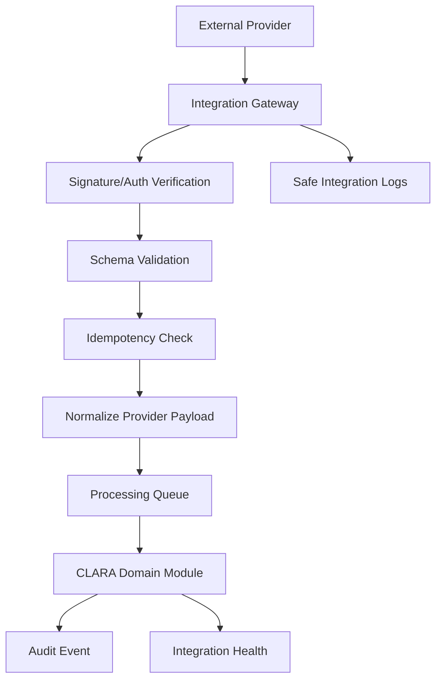

# PART-07 — Integration Implementation Plan

> *"Every integration is a bridge across a trust boundary."*

---

# Purpose

Part 07 defines how CLARA integrations and channels should be implemented safely and consistently.

It covers:

- Integration Gateway architecture.
- Provider adapter pattern.
- Connector lifecycle.
- Credential and secret handling.
- Inbound webhook ingestion.
- Outbound webhook delivery.
- Channel adapter implementation.
- Web Chat channel implementation.
- Custom API channel implementation.
- Email channel implementation.
- WhatsApp and social channel implementation.
- External reference and idempotency strategy.
- Integration sync jobs and backfill.
- Retry, dead-letter, and failure handling.
- Integration observability and health.
- Integration permissions and governance.
- Integration security testing.
- Integration release and rollout strategy.

---

# Chapter Map

| Chapter | Title |
|---:|---|
| 106 | Integration Implementation Plan Overview |
| 107 | Integration Gateway Architecture |
| 108 | Provider Adapter Pattern |
| 109 | Connector Lifecycle Implementation |
| 110 | Credential and Secret Handling |
| 111 | Inbound Webhook Ingestion |
| 112 | Outbound Webhook Delivery |
| 113 | Channel Adapter Implementation |
| 114 | Web Chat Channel Implementation |
| 115 | Custom API Channel Implementation |
| 116 | Email Channel Implementation |
| 117 | WhatsApp and Social Channel Implementation |
| 118 | External Reference and Idempotency Strategy |
| 119 | Integration Sync Jobs and Backfill |
| 120 | Retry Dead Letter and Failure Handling |
| 121 | Integration Observability and Health |
| 122 | Integration Permissions and Governance |
| 123 | Integration Security Testing |
| 124 | Integration Release and Rollout Strategy |
| 125 | Part 07 Summary |

---

# Integration Execution Map



---

# Integration Non-Negotiables

CLARA integration implementation must enforce:

```text
No raw secrets in normal database tables
No unvalidated webhook payloads
No unsigned webhooks where provider signature is available
No duplicate processing without idempotency checks
No provider payload trusted as internal data
No cross-workspace integration access
No unsafe outbound webhook payloads
No silent integration failures
No unofficial scraping as production foundation
No integration setup without elevated permission
```

---

# MVP Integration Scope

MVP should include:

```text
Integration Gateway
One reliable communication channel
Web Chat or Custom API Channel
Provider adapter abstraction
Safe credential reference pattern
Inbound event validation
Idempotent message ingestion
Basic integration status
Basic failure logging
Basic audit events
```

MVP should defer:

```text
Large connector marketplace
Many social channels
Advanced bidirectional sync
Complex CRM sync conflict resolution
Full webhook replay UI
Full email threading complexity
Unofficial social scraping as core architecture
```

---

# Navigation

**Previous:** `../PART-06-AI-Implementation-Plan/105-Part-06-Summary.md`

**Next:** `106-Integration-Implementation-Plan-Overview.md`
