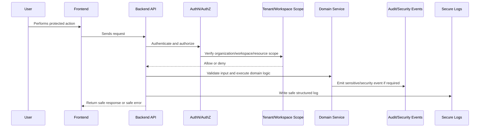

# Security Implementation Plan Overview

> *"Defines the security implementation plan for CLARA across authentication, authorization, tenant isolation, validation, logging, audit, AI, integrations, testing, and release gates."*

---

# Purpose

Defines the security implementation plan for CLARA across authentication, authorization, tenant isolation, validation, logging, audit, AI, integrations, testing, and release gates.

---

# Security Problem

Security added at the end usually becomes patchy, inconsistent, and easy to bypass.

---

# Security Decision

## Decision

CLARA security must be implemented as part of normal engineering execution, not as a final checklist before release.

## Status

Accepted.

---

# Security Implementation Rule

Every security-sensitive feature must be designed as:

```text
Threat -> Control -> Implementation -> Test -> Audit/Monitoring -> Release Gate
```

Security controls must exist in code, tests, review, and operations.

A checklist without enforcement is not enough.

---

# Recommended Security Flow



---

# Secure-by-Design Checklist

- [ ] Threat is identified.
- [ ] Asset being protected is clear.
- [ ] Actor and attacker model are clear.
- [ ] Backend authorization exists where needed.
- [ ] Organization/workspace scope is enforced.
- [ ] Input validation exists.
- [ ] Output safety is considered.
- [ ] Secrets are protected.
- [ ] Logs are redacted.
- [ ] Audit/security event is defined where relevant.
- [ ] Tests cover abuse/unauthorized cases.
- [ ] Release gate is defined.

---

# Acceptance Criteria

- [ ] Security control is actionable.
- [ ] Implementation guidance is clear.
- [ ] Testing expectations are included.
- [ ] Audit/monitoring expectations are included.
- [ ] MVP and future concerns are separated.
- [ ] AI and integration risks are considered where relevant.
- [ ] AI coding assistants can follow this safely.

---

# Anti-patterns

Avoid:

- Treating frontend checks as authorization.
- Adding security only after feature completion.
- Logging raw secrets, tokens, prompts, or provider payloads.
- Trusting external provider payloads.
- Building AI context without permission checks.
- Returning raw database errors to users.
- Using real customer data in development.
- Committing `.env` files or credentials.
- Shipping high-risk changes without security review.
- Creating tests only for happy paths.

---

# Related Documents

- ../PART-03-Backend-Implementation-Plan/README.md
- ../PART-05-Database-and-Migration-Plan/README.md
- ../PART-06-AI-Implementation-Plan/README.md
- ../PART-07-Integration-Implementation-Plan/README.md
- ../../BOOK-04-Product-Domain-Specification/BOOK-04-Master-Index/BOOK-04-PERMISSION-MAP.md
- ../../BOOK-04-Product-Domain-Specification/BOOK-04-Master-Index/BOOK-04-AI-GOVERNANCE-MAP.md

---

# Navigation

**Previous:** `../PART-07-Integration-Implementation-Plan/125-Part-07-Summary.md`

**Next:** `127-Threat-Model-and-Trust-Boundaries.md`

---

# Security MVP Build Order

Recommended order:

```text
1. Auth/session baseline
2. RBAC policy helpers
3. Tenant/workspace scope helpers
4. Input validation standard
5. Error response standard
6. Secure logging/redaction
7. Audit/security event pipeline
8. Secret/config standard
9. AI security controls
10. Integration security controls
11. Security test suite
12. Release gate checklist
```

---

# Security Ownership

Security is shared:

```text
Backend owns enforcement
Frontend owns safe rendering and UX warnings
Database owns scope/constraints
AI owns context/prompt/output safety
Integrations own external trust boundaries
DevOps owns secrets/deployment hardening
QA owns abuse/regression validation
```
