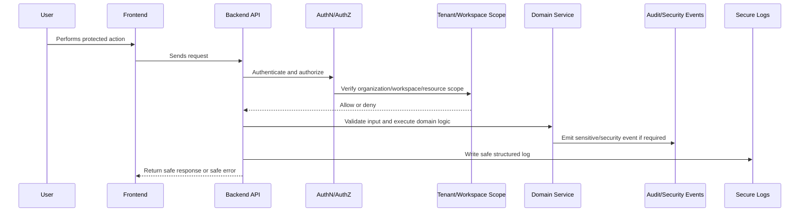

# Authentication Hardening

> *"Defines implementation plan for login, sessions, tokens, password handling, MFA readiness, session expiration, and account security."*

---

# Purpose

Defines implementation plan for login, sessions, tokens, password handling, MFA readiness, session expiration, and account security.

---

# Security Problem

Weak authentication breaks every downstream authorization, audit, and compliance decision.

---

# Security Decision

## Decision

CLARA authentication must create a reliable actor identity with safe session/token handling before protected actions run.

## Status

Accepted.

---

# Security Implementation Rule

Every security-sensitive feature must be designed as:

```text
Threat -> Control -> Implementation -> Test -> Audit/Monitoring -> Release Gate
```

Security controls must exist in code, tests, review, and operations.

A checklist without enforcement is not enough.

---

# Recommended Security Flow



---

# Secure-by-Design Checklist

- [ ] Threat is identified.
- [ ] Asset being protected is clear.
- [ ] Actor and attacker model are clear.
- [ ] Backend authorization exists where needed.
- [ ] Organization/workspace scope is enforced.
- [ ] Input validation exists.
- [ ] Output safety is considered.
- [ ] Secrets are protected.
- [ ] Logs are redacted.
- [ ] Audit/security event is defined where relevant.
- [ ] Tests cover abuse/unauthorized cases.
- [ ] Release gate is defined.

---

# Acceptance Criteria

- [ ] Security control is actionable.
- [ ] Implementation guidance is clear.
- [ ] Testing expectations are included.
- [ ] Audit/monitoring expectations are included.
- [ ] MVP and future concerns are separated.
- [ ] AI and integration risks are considered where relevant.
- [ ] AI coding assistants can follow this safely.

---

# Anti-patterns

Avoid:

- Treating frontend checks as authorization.
- Adding security only after feature completion.
- Logging raw secrets, tokens, prompts, or provider payloads.
- Trusting external provider payloads.
- Building AI context without permission checks.
- Returning raw database errors to users.
- Using real customer data in development.
- Committing `.env` files or credentials.
- Shipping high-risk changes without security review.
- Creating tests only for happy paths.

---

# Related Documents

- ../PART-03-Backend-Implementation-Plan/README.md
- ../PART-05-Database-and-Migration-Plan/README.md
- ../PART-06-AI-Implementation-Plan/README.md
- ../PART-07-Integration-Implementation-Plan/README.md
- ../../BOOK-04-Product-Domain-Specification/BOOK-04-Master-Index/BOOK-04-PERMISSION-MAP.md
- ../../BOOK-04-Product-Domain-Specification/BOOK-04-Master-Index/BOOK-04-AI-GOVERNANCE-MAP.md

---

# Navigation

**Previous:** `127-Threat-Model-and-Trust-Boundaries.md`

**Next:** `129-Authorization-and-RBAC-Enforcement.md`

---

# Authentication Controls

Implement:

```text
secure password hashing if password auth exists
secure session cookies or token handling
session expiration
session revocation
login rate limit
account lock / throttling strategy
password reset safety if supported
MFA readiness for future
```

---

# Session Cookie Baseline

For web apps, session cookies should consider:

```text
HttpOnly
Secure
SameSite=Lax or Strict depending on flow
short-lived access token/session where practical
refresh/rotation strategy if used
```

---

# Auth Audit Events

Audit/security events:

```text
auth.login.succeeded
auth.login.failed
auth.logout
auth.password_reset.requested
auth.session.revoked
auth.mfa.enabled
auth.mfa.disabled
```
