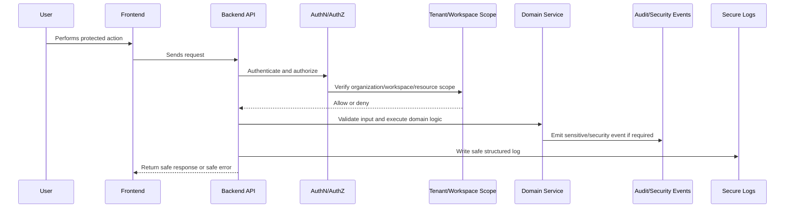

# Data Protection and Privacy Controls

> *"Defines implementation plan for protecting customer data, internal notes, attachments, AI data, exports, retention, deletion, and privacy boundaries."*

---

# Purpose

Defines implementation plan for protecting customer data, internal notes, attachments, AI data, exports, retention, deletion, and privacy boundaries.

---

# Security Problem

Customer and operational data can create privacy, compliance, and trust risks if stored or exposed carelessly.

---

# Security Decision

## Decision

CLARA should minimize sensitive data exposure, apply scoped access controls, restrict exports, and define retention/deletion behavior clearly.

## Status

Accepted.

---

# Security Implementation Rule

Every security-sensitive feature must be designed as:

```text
Threat -> Control -> Implementation -> Test -> Audit/Monitoring -> Release Gate
```

Security controls must exist in code, tests, review, and operations.

A checklist without enforcement is not enough.

---

# Recommended Security Flow



---

# Secure-by-Design Checklist

- [ ] Threat is identified.
- [ ] Asset being protected is clear.
- [ ] Actor and attacker model are clear.
- [ ] Backend authorization exists where needed.
- [ ] Organization/workspace scope is enforced.
- [ ] Input validation exists.
- [ ] Output safety is considered.
- [ ] Secrets are protected.
- [ ] Logs are redacted.
- [ ] Audit/security event is defined where relevant.
- [ ] Tests cover abuse/unauthorized cases.
- [ ] Release gate is defined.

---

# Acceptance Criteria

- [ ] Security control is actionable.
- [ ] Implementation guidance is clear.
- [ ] Testing expectations are included.
- [ ] Audit/monitoring expectations are included.
- [ ] MVP and future concerns are separated.
- [ ] AI and integration risks are considered where relevant.
- [ ] AI coding assistants can follow this safely.

---

# Anti-patterns

Avoid:

- Treating frontend checks as authorization.
- Adding security only after feature completion.
- Logging raw secrets, tokens, prompts, or provider payloads.
- Trusting external provider payloads.
- Building AI context without permission checks.
- Returning raw database errors to users.
- Using real customer data in development.
- Committing `.env` files or credentials.
- Shipping high-risk changes without security review.
- Creating tests only for happy paths.

---

# Related Documents

- ../PART-03-Backend-Implementation-Plan/README.md
- ../PART-05-Database-and-Migration-Plan/README.md
- ../PART-06-AI-Implementation-Plan/README.md
- ../PART-07-Integration-Implementation-Plan/README.md
- ../../BOOK-04-Product-Domain-Specification/BOOK-04-Master-Index/BOOK-04-PERMISSION-MAP.md
- ../../BOOK-04-Product-Domain-Specification/BOOK-04-Master-Index/BOOK-04-AI-GOVERNANCE-MAP.md

---

# Navigation

**Previous:** `137-Audit-and-Security-Event-Implementation.md`

**Next:** `139-File-Attachment-and-Media-Security.md`

---

# Data Protection Controls

Implement:

```text
least-privilege access
workspace scoping
export restrictions
redaction in logs
safe attachment access
retention policies
soft-delete/archive rules
PII minimization
AI context minimization
```

---

# Export Controls

Exports should require:

```text
elevated permission
scope selection
audit event
rate/size limits
safe file delivery
expiration where practical
```

---

# Privacy Rule

Do not use real customer data in development, tests, screenshots, or seed files.
