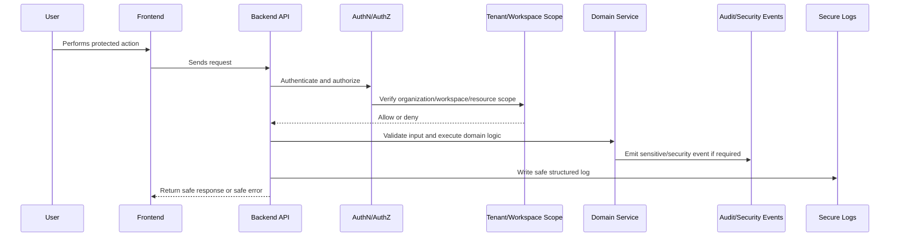

# AI Security Controls

> *"Defines implementation plan for AI-specific security, including prompt injection defense, context isolation, output safety, human review, AI audit, and model provider risk."*

---

# Purpose

Defines implementation plan for AI-specific security, including prompt injection defense, context isolation, output safety, human review, AI audit, and model provider risk.

---

# Security Problem

AI can leak data, follow malicious instructions, hallucinate unsafe guidance, or bypass workflows if not constrained.

---

# Security Decision

## Decision

CLARA AI must enforce permission-aware context, prompt boundaries, knowledge eligibility, human review, and safe logging.

## Status

Accepted.

---

# Security Implementation Rule

Every security-sensitive feature must be designed as:

```text
Threat -> Control -> Implementation -> Test -> Audit/Monitoring -> Release Gate
```

Security controls must exist in code, tests, review, and operations.

A checklist without enforcement is not enough.

---

# Recommended Security Flow



---

# Secure-by-Design Checklist

- [ ] Threat is identified.
- [ ] Asset being protected is clear.
- [ ] Actor and attacker model are clear.
- [ ] Backend authorization exists where needed.
- [ ] Organization/workspace scope is enforced.
- [ ] Input validation exists.
- [ ] Output safety is considered.
- [ ] Secrets are protected.
- [ ] Logs are redacted.
- [ ] Audit/security event is defined where relevant.
- [ ] Tests cover abuse/unauthorized cases.
- [ ] Release gate is defined.

---

# Acceptance Criteria

- [ ] Security control is actionable.
- [ ] Implementation guidance is clear.
- [ ] Testing expectations are included.
- [ ] Audit/monitoring expectations are included.
- [ ] MVP and future concerns are separated.
- [ ] AI and integration risks are considered where relevant.
- [ ] AI coding assistants can follow this safely.

---

# Anti-patterns

Avoid:

- Treating frontend checks as authorization.
- Adding security only after feature completion.
- Logging raw secrets, tokens, prompts, or provider payloads.
- Trusting external provider payloads.
- Building AI context without permission checks.
- Returning raw database errors to users.
- Using real customer data in development.
- Committing `.env` files or credentials.
- Shipping high-risk changes without security review.
- Creating tests only for happy paths.

---

# Related Documents

- ../PART-03-Backend-Implementation-Plan/README.md
- ../PART-05-Database-and-Migration-Plan/README.md
- ../PART-06-AI-Implementation-Plan/README.md
- ../PART-07-Integration-Implementation-Plan/README.md
- ../../BOOK-04-Product-Domain-Specification/BOOK-04-Master-Index/BOOK-04-PERMISSION-MAP.md
- ../../BOOK-04-Product-Domain-Specification/BOOK-04-Master-Index/BOOK-04-AI-GOVERNANCE-MAP.md

---

# Navigation

**Previous:** `139-File-Attachment-and-Media-Security.md`

**Next:** `141-Integration-Security-Controls.md`

---

# AI Security Controls

Implement:

```text
AI feature permission
underlying resource permission
workspace/org scope checks
context minimization
knowledge eligibility filter
prompt injection defense
output safety checks
human review
safe audit metadata
rate limits and quotas
```

---

# AI Do-Not List

AI must not:

```text
auto-send customer replies in MVP
access unauthorized context
use draft/private knowledge as trusted grounding by default
reveal hidden prompts
execute high-risk actions without approval
write secrets into logs
```
