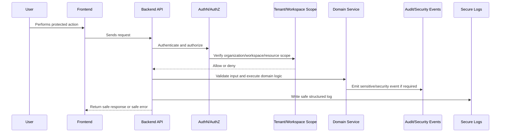

# Security Testing and Release Gates

> *"Defines security testing strategy, release gates, CI checks, abuse tests, authorization tests, integration tests, AI red-team tests, and production readiness criteria."*

---

# Purpose

Defines security testing strategy, release gates, CI checks, abuse tests, authorization tests, integration tests, AI red-team tests, and production readiness criteria.

---

# Security Problem

Features can pass normal functional tests while still being insecure.

---

# Security Decision

## Decision

CLARA releases should require automated and human security checks based on risk level.

## Status

Accepted.

---

# Security Implementation Rule

Every security-sensitive feature must be designed as:

```text
Threat -> Control -> Implementation -> Test -> Audit/Monitoring -> Release Gate
```

Security controls must exist in code, tests, review, and operations.

A checklist without enforcement is not enough.

---

# Recommended Security Flow



---

# Secure-by-Design Checklist

- [ ] Threat is identified.
- [ ] Asset being protected is clear.
- [ ] Actor and attacker model are clear.
- [ ] Backend authorization exists where needed.
- [ ] Organization/workspace scope is enforced.
- [ ] Input validation exists.
- [ ] Output safety is considered.
- [ ] Secrets are protected.
- [ ] Logs are redacted.
- [ ] Audit/security event is defined where relevant.
- [ ] Tests cover abuse/unauthorized cases.
- [ ] Release gate is defined.

---

# Acceptance Criteria

- [ ] Security control is actionable.
- [ ] Implementation guidance is clear.
- [ ] Testing expectations are included.
- [ ] Audit/monitoring expectations are included.
- [ ] MVP and future concerns are separated.
- [ ] AI and integration risks are considered where relevant.
- [ ] AI coding assistants can follow this safely.

---

# Anti-patterns

Avoid:

- Treating frontend checks as authorization.
- Adding security only after feature completion.
- Logging raw secrets, tokens, prompts, or provider payloads.
- Trusting external provider payloads.
- Building AI context without permission checks.
- Returning raw database errors to users.
- Using real customer data in development.
- Committing `.env` files or credentials.
- Shipping high-risk changes without security review.
- Creating tests only for happy paths.

---

# Related Documents

- ../PART-03-Backend-Implementation-Plan/README.md
- ../PART-05-Database-and-Migration-Plan/README.md
- ../PART-06-AI-Implementation-Plan/README.md
- ../PART-07-Integration-Implementation-Plan/README.md
- ../../BOOK-04-Product-Domain-Specification/BOOK-04-Master-Index/BOOK-04-PERMISSION-MAP.md
- ../../BOOK-04-Product-Domain-Specification/BOOK-04-Master-Index/BOOK-04-AI-GOVERNANCE-MAP.md

---

# Navigation

**Previous:** `143-Dependency-and-Supply-Chain-Security.md`

**Next:** `145-Part-08-Summary.md`

---

# Security Test Types

Required:

```text
authorization tests
cross-tenant isolation tests
input validation tests
XSS rendering tests where practical
CSRF tests where relevant
injection tests for filters/search
webhook signature/idempotency tests
AI prompt injection/context tests
secret leakage checks
export permission tests
```

---

# Release Gates

Before release:

- [ ] CI passes.
- [ ] Auth/RBAC tests pass.
- [ ] Cross-tenant tests pass.
- [ ] No known critical/high vulnerabilities.
- [ ] No secrets detected in repo.
- [ ] Security-sensitive changes reviewed.
- [ ] Audit events implemented where required.
- [ ] Logs reviewed for sensitive leakage.
- [ ] Rollback plan exists for high-risk deployment.
