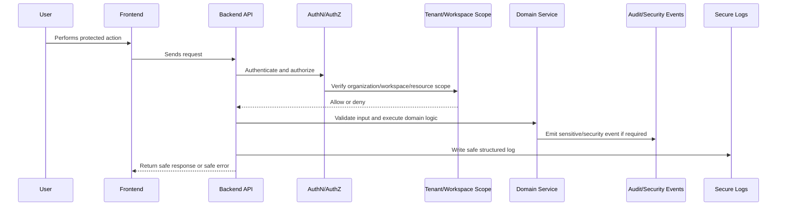

# Part 08 Summary

> *"Summarizes Security Implementation Plan and defines readiness to continue into Testing and QA Execution."*

---

# Purpose

Summarizes Security Implementation Plan and defines readiness to continue into Testing and QA Execution.

---

# Security Problem

Testing and QA planning must build directly on security controls so quality and security are verified together.

---

# Security Decision

## Decision

CLARA should proceed to Testing and QA Execution after security controls, threat model, auth, RBAC, tenant isolation, validation, secrets, audit, AI security, integration security, and release gates are defined.

## Status

Accepted.

---

# Security Implementation Rule

Every security-sensitive feature must be designed as:

```text
Threat -> Control -> Implementation -> Test -> Audit/Monitoring -> Release Gate
```

Security controls must exist in code, tests, review, and operations.

A checklist without enforcement is not enough.

---

# Recommended Security Flow



---

# Secure-by-Design Checklist

- [ ] Threat is identified.
- [ ] Asset being protected is clear.
- [ ] Actor and attacker model are clear.
- [ ] Backend authorization exists where needed.
- [ ] Organization/workspace scope is enforced.
- [ ] Input validation exists.
- [ ] Output safety is considered.
- [ ] Secrets are protected.
- [ ] Logs are redacted.
- [ ] Audit/security event is defined where relevant.
- [ ] Tests cover abuse/unauthorized cases.
- [ ] Release gate is defined.

---

# Acceptance Criteria

- [ ] Security control is actionable.
- [ ] Implementation guidance is clear.
- [ ] Testing expectations are included.
- [ ] Audit/monitoring expectations are included.
- [ ] MVP and future concerns are separated.
- [ ] AI and integration risks are considered where relevant.
- [ ] AI coding assistants can follow this safely.

---

# Anti-patterns

Avoid:

- Treating frontend checks as authorization.
- Adding security only after feature completion.
- Logging raw secrets, tokens, prompts, or provider payloads.
- Trusting external provider payloads.
- Building AI context without permission checks.
- Returning raw database errors to users.
- Using real customer data in development.
- Committing `.env` files or credentials.
- Shipping high-risk changes without security review.
- Creating tests only for happy paths.

---

# Related Documents

- ../PART-03-Backend-Implementation-Plan/README.md
- ../PART-05-Database-and-Migration-Plan/README.md
- ../PART-06-AI-Implementation-Plan/README.md
- ../PART-07-Integration-Implementation-Plan/README.md
- ../../BOOK-04-Product-Domain-Specification/BOOK-04-Master-Index/BOOK-04-PERMISSION-MAP.md
- ../../BOOK-04-Product-Domain-Specification/BOOK-04-Master-Index/BOOK-04-AI-GOVERNANCE-MAP.md

---

# Navigation

**Previous:** `144-Security-Testing-and-Release-Gates.md`

**Next:** `../PART-09-Testing-and-QA-Execution/README.md`

---

# Part 08 Completion

Part 08 establishes:

- Security implementation overview.
- Threat model and trust boundaries.
- Authentication hardening.
- Authorization/RBAC enforcement.
- Tenant/workspace isolation security.
- Input validation and output encoding.
- XSS/CSRF/browser security.
- Injection prevention.
- SSRF/RCE prevention.
- Secret management and secure configuration.
- Secure logging and PII redaction.
- Audit and security events.
- Data protection/privacy controls.
- File/attachment security.
- AI security controls.
- Integration security controls.
- Workflow automation security controls.
- Dependency/supply-chain security.
- Security testing and release gates.

---

# Ready for Part 09

The next part should be:

```text
BOOK V — PART 09: Testing and QA Execution
```

It should define:

- Test strategy.
- Unit tests.
- Integration tests.
- E2E tests.
- API contract tests.
- Database/migration tests.
- Security tests.
- AI evaluation tests.
- Integration/provider tests.
- Regression strategy.
- Test data strategy.
- QA release process.
