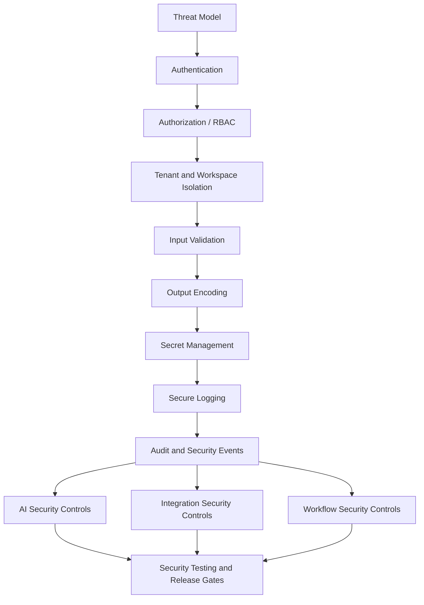

# PART-08 — Security Implementation Plan

> *"Security is not a feature at the end. Security is how CLARA earns trust while it runs."*

---

# Purpose

Part 08 defines how CLARA security should be implemented across product, engineering, AI, integrations, data, and operations.

It covers:

- Threat model and trust boundaries.
- Authentication hardening.
- Authorization and RBAC enforcement.
- Tenant/workspace isolation security.
- Input validation and output encoding.
- XSS, CSRF, and browser security.
- Injection prevention.
- SSRF, RCE, and unsafe execution prevention.
- Secret management and secure configuration.
- Secure logging and PII redaction.
- Audit and security event implementation.
- Data protection and privacy controls.
- File attachment and media security.
- AI security controls.
- Integration security controls.
- Workflow and automation security controls.
- Dependency and supply-chain security.
- Security testing and release gates.

---

# Chapter Map

| Chapter | Title |
|---:|---|
| 126 | Security Implementation Plan Overview |
| 127 | Threat Model and Trust Boundaries |
| 128 | Authentication Hardening |
| 129 | Authorization and RBAC Enforcement |
| 130 | Tenant and Workspace Isolation Security |
| 131 | Input Validation and Output Encoding |
| 132 | XSS CSRF and Browser Security |
| 133 | Injection Prevention |
| 134 | SSRF RCE and Unsafe Execution Prevention |
| 135 | Secret Management and Secure Configuration |
| 136 | Secure Logging and PII Redaction |
| 137 | Audit and Security Event Implementation |
| 138 | Data Protection and Privacy Controls |
| 139 | File Attachment and Media Security |
| 140 | AI Security Controls |
| 141 | Integration Security Controls |
| 142 | Workflow and Automation Security Controls |
| 143 | Dependency and Supply Chain Security |
| 144 | Security Testing and Release Gates |
| 145 | Part 08 Summary |

---

# Security Execution Map



---

# Security Non-Negotiables

CLARA security implementation must enforce:

```text
Authentication before protected actions
Backend authorization for every protected action
Organization/workspace isolation on every scoped query
Input validation for every external input
Safe output rendering for user/customer/AI content
No secrets in code, client bundle, logs, or docs
Audit/security events for sensitive actions
Safe logging with redaction
Webhook signature validation where available
Idempotency and replay protection for integrations
Human review for customer-visible AI output
No AI bypass of permissions or scope
No unsafe file upload/download behavior
Security tests before release
```

---

# MVP Security Scope

MVP must include:

```text
Authentication baseline
Session/token safety
RBAC baseline
Tenant/workspace isolation tests
Input validation
Safe frontend rendering
Secure config pattern
Secret scanning/checking
Audit events for sensitive actions
Secure logging baseline
AI security baseline
Webhook/API channel security baseline
Dependency scanning where practical
Security release checklist
```

MVP may defer:

```text
Enterprise SSO
Advanced SIEM integration
Full DLP system
Formal compliance certification
Advanced anomaly detection
Dedicated security operations center
```

---

# Navigation

**Previous:** `../PART-07-Integration-Implementation-Plan/125-Part-07-Summary.md`

**Next:** `126-Security-Implementation-Plan-Overview.md`
