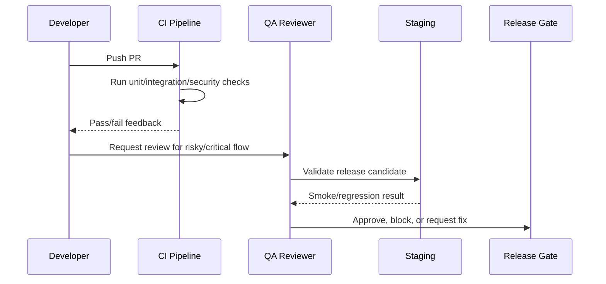

# Testing and QA Execution Overview

> *"Defines the testing and QA execution plan for CLARA across backend, frontend, database, AI, integrations, security, performance, accessibility, and release validation."*

---

# Purpose

Defines the testing and QA execution plan for CLARA across backend, frontend, database, AI, integrations, security, performance, accessibility, and release validation.

---

# Quality Problem

Without a testing execution plan, CLARA may appear functional while still failing under real users, edge cases, integrations, AI uncertainty, or security abuse.

---

# Testing Decision

## Decision

CLARA testing must be built into normal development workflow and must validate product behavior, security boundaries, and production readiness.

## Status

Accepted.

---

# Testing Implementation Rule

Every testable feature must be designed as:

```text
Requirement -> Risk -> Test Type -> Test Data -> Expected Result -> CI/QA Gate
```

Do not test only happy paths.

Do not rely only on manual testing.

Do not allow protected workflows to ship without authorization and scope tests.

---

# Recommended QA Flow



---

# Secure-by-Design Checklist

- [ ] Tests include unauthorized access cases.
- [ ] Tests include wrong organization/workspace cases.
- [ ] Tests include invalid input cases.
- [ ] Tests include safe error responses.
- [ ] Tests do not use real customer data.
- [ ] Tests do not require real secrets in CI.
- [ ] External providers are mocked/sandboxed.
- [ ] AI provider calls are mocked for deterministic tests.
- [ ] Critical journeys are covered.
- [ ] CI gate is clear.

---

# Acceptance Criteria

- [ ] Test objective is clear.
- [ ] Test layer is appropriate.
- [ ] Test data is safe.
- [ ] Security coverage is included where relevant.
- [ ] Failure behavior is tested.
- [ ] CI/QA ownership is defined.
- [ ] AI coding assistants can follow this safely.

---

# Anti-patterns

Avoid:

- Testing only happy paths.
- Relying on manual testing for every release.
- Using real customer data in tests.
- Calling real AI providers in normal CI.
- Calling real payment/integration providers in normal CI.
- Skipping authorization tests.
- Skipping migration tests.
- Building flaky E2E tests for every tiny behavior.
- Treating screenshots as proof of correctness.
- Marking bugs fixed without reproduction and verification.

---

# Related Documents

- ../PART-03-Backend-Implementation-Plan/README.md
- ../PART-04-Frontend-Implementation-Plan/README.md
- ../PART-05-Database-and-Migration-Plan/README.md
- ../PART-06-AI-Implementation-Plan/README.md
- ../PART-07-Integration-Implementation-Plan/README.md
- ../PART-08-Security-Implementation-Plan/README.md
- ../../BOOK-04-Product-Domain-Specification/BOOK-04-Master-Index/BOOK-04-MVP-SCOPE-MAP.md

---

# Navigation

**Previous:** `../PART-08-Security-Implementation-Plan/145-Part-08-Summary.md`

**Next:** `147-Testing-Strategy-and-Test-Pyramid.md`

---

# QA MVP Build Order

Recommended order:

```text
1. Unit test setup
2. Backend integration test setup
3. Test database setup
4. Fixture/factory strategy
5. Authorization/scope test helpers
6. Frontend component/page test setup
7. API contract tests
8. AI mocked-provider tests
9. Webhook/idempotency tests
10. Release candidate checklist
11. Smoke test scripts
12. CI quality gates
```

---

# QA Ownership

Quality is shared:

```text
Developers own first-level automated tests
Reviewers own test adequacy review
QA owns exploratory/regression validation
Security owns abuse/security test criteria
Product owns acceptance behavior
DevOps owns smoke/release gates
```
