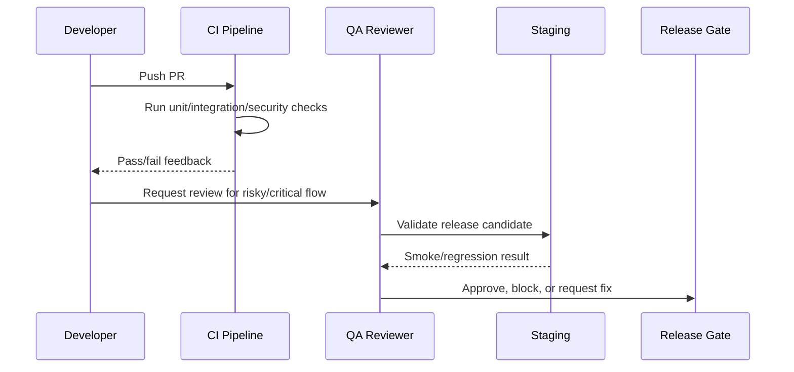

# Testing Strategy and Test Pyramid

> *"Defines CLARA's test strategy, test pyramid, ownership, and test layering."*

---

# Purpose

Defines CLARA's test strategy, test pyramid, ownership, and test layering.

---

# Quality Problem

Relying only on manual QA or only on E2E tests creates slow feedback and fragile quality.

---

# Testing Decision

## Decision

CLARA should use a balanced test pyramid with strong unit tests, meaningful integration tests, focused E2E tests, security tests, and AI evaluation tests.

## Status

Accepted.

---

# Testing Implementation Rule

Every testable feature must be designed as:

```text
Requirement -> Risk -> Test Type -> Test Data -> Expected Result -> CI/QA Gate
```

Do not test only happy paths.

Do not rely only on manual testing.

Do not allow protected workflows to ship without authorization and scope tests.

---

# Recommended QA Flow



---

# Secure-by-Design Checklist

- [ ] Tests include unauthorized access cases.
- [ ] Tests include wrong organization/workspace cases.
- [ ] Tests include invalid input cases.
- [ ] Tests include safe error responses.
- [ ] Tests do not use real customer data.
- [ ] Tests do not require real secrets in CI.
- [ ] External providers are mocked/sandboxed.
- [ ] AI provider calls are mocked for deterministic tests.
- [ ] Critical journeys are covered.
- [ ] CI gate is clear.

---

# Acceptance Criteria

- [ ] Test objective is clear.
- [ ] Test layer is appropriate.
- [ ] Test data is safe.
- [ ] Security coverage is included where relevant.
- [ ] Failure behavior is tested.
- [ ] CI/QA ownership is defined.
- [ ] AI coding assistants can follow this safely.

---

# Anti-patterns

Avoid:

- Testing only happy paths.
- Relying on manual testing for every release.
- Using real customer data in tests.
- Calling real AI providers in normal CI.
- Calling real payment/integration providers in normal CI.
- Skipping authorization tests.
- Skipping migration tests.
- Building flaky E2E tests for every tiny behavior.
- Treating screenshots as proof of correctness.
- Marking bugs fixed without reproduction and verification.

---

# Related Documents

- ../PART-03-Backend-Implementation-Plan/README.md
- ../PART-04-Frontend-Implementation-Plan/README.md
- ../PART-05-Database-and-Migration-Plan/README.md
- ../PART-06-AI-Implementation-Plan/README.md
- ../PART-07-Integration-Implementation-Plan/README.md
- ../PART-08-Security-Implementation-Plan/README.md
- ../../BOOK-04-Product-Domain-Specification/BOOK-04-Master-Index/BOOK-04-MVP-SCOPE-MAP.md

---

# Navigation

**Previous:** `146-Testing-and-QA-Execution-Overview.md`

**Next:** `148-Unit-Testing-Plan.md`

---

# CLARA Test Pyramid

Recommended balance:

```text
Many unit tests
Medium integration tests
Focused API contract tests
Focused E2E tests
Targeted security tests
Scenario-based AI evaluations
Smoke tests for deployment
```

---

# Test Type Purpose

| Test Type | Purpose |
|---|---|
| Unit | Fast logic validation |
| Integration | Module/database/API collaboration |
| API Contract | Stable request/response behavior |
| E2E | Critical user journeys |
| Security | Abuse and boundary validation |
| AI Eval | Output quality/safety scenarios |
| Smoke | Deployment runtime health |

---

# Rule

The higher the test layer, the fewer and more valuable the tests should be.
