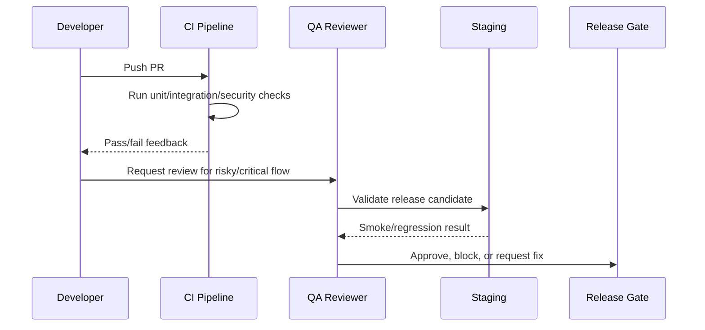

# Integration and Webhook Testing

> *"Defines testing strategy for integrations, channel adapters, webhooks, provider payloads, idempotency, retries, and credential handling."*

---

# Purpose

Defines testing strategy for integrations, channel adapters, webhooks, provider payloads, idempotency, retries, and credential handling.

---

# Quality Problem

Integrations are high-risk external boundaries where payloads can be malformed, replayed, duplicated, or malicious.

---

# Testing Decision

## Decision

Integration tests must validate untrusted provider input, duplicate events, invalid signatures, retry behavior, and safe secret handling.

## Status

Accepted.

---

# Testing Implementation Rule

Every testable feature must be designed as:

```text
Requirement -> Risk -> Test Type -> Test Data -> Expected Result -> CI/QA Gate
```

Do not test only happy paths.

Do not rely only on manual testing.

Do not allow protected workflows to ship without authorization and scope tests.

---

# Recommended QA Flow



---

# Secure-by-Design Checklist

- [ ] Tests include unauthorized access cases.
- [ ] Tests include wrong organization/workspace cases.
- [ ] Tests include invalid input cases.
- [ ] Tests include safe error responses.
- [ ] Tests do not use real customer data.
- [ ] Tests do not require real secrets in CI.
- [ ] External providers are mocked/sandboxed.
- [ ] AI provider calls are mocked for deterministic tests.
- [ ] Critical journeys are covered.
- [ ] CI gate is clear.

---

# Acceptance Criteria

- [ ] Test objective is clear.
- [ ] Test layer is appropriate.
- [ ] Test data is safe.
- [ ] Security coverage is included where relevant.
- [ ] Failure behavior is tested.
- [ ] CI/QA ownership is defined.
- [ ] AI coding assistants can follow this safely.

---

# Anti-patterns

Avoid:

- Testing only happy paths.
- Relying on manual testing for every release.
- Using real customer data in tests.
- Calling real AI providers in normal CI.
- Calling real payment/integration providers in normal CI.
- Skipping authorization tests.
- Skipping migration tests.
- Building flaky E2E tests for every tiny behavior.
- Treating screenshots as proof of correctness.
- Marking bugs fixed without reproduction and verification.

---

# Related Documents

- ../PART-03-Backend-Implementation-Plan/README.md
- ../PART-04-Frontend-Implementation-Plan/README.md
- ../PART-05-Database-and-Migration-Plan/README.md
- ../PART-06-AI-Implementation-Plan/README.md
- ../PART-07-Integration-Implementation-Plan/README.md
- ../PART-08-Security-Implementation-Plan/README.md
- ../../BOOK-04-Product-Domain-Specification/BOOK-04-Master-Index/BOOK-04-MVP-SCOPE-MAP.md

---

# Navigation

**Previous:** `154-AI-Evaluation-and-Testing.md`

**Next:** `156-Frontend-Testing-Execution.md`

---

# Integration/Webhook Test Cases

Test:

```text
valid signed webhook accepted
invalid signature rejected
missing signature rejected where required
duplicate event ignored safely
malformed payload rejected
unknown provider account rejected
wrong workspace mapping rejected
provider retry handled idempotently
delivery retry logs attempts
dead-letter created after repeated failure
raw credential not returned
```

---

# Provider Testing Strategy

Use:

```text
fake adapter for local tests
recorded sanitized fixtures if needed
sandbox provider only for staging validation
no production provider calls in CI
```
