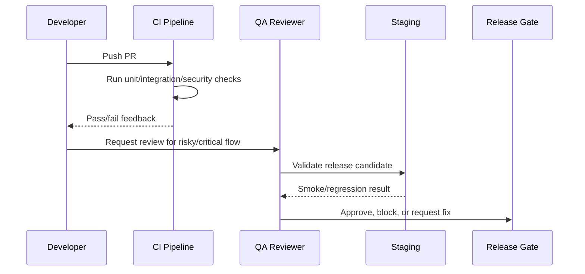

# Frontend Testing Execution

> *"Defines frontend testing execution for components, pages, forms, permission-aware UI, AI review UI, error states, and accessibility basics."*

---

# Purpose

Defines frontend testing execution for components, pages, forms, permission-aware UI, AI review UI, error states, and accessibility basics.

---

# Quality Problem

Frontend bugs can cause unsafe replies, hidden data exposure, broken workflows, and poor user trust.

---

# Testing Decision

## Decision

CLARA frontend should test critical UI behavior, user flows, safe rendering, loading/empty/error states, and permission-aware interactions.

## Status

Accepted.

---

# Testing Implementation Rule

Every testable feature must be designed as:

```text
Requirement -> Risk -> Test Type -> Test Data -> Expected Result -> CI/QA Gate
```

Do not test only happy paths.

Do not rely only on manual testing.

Do not allow protected workflows to ship without authorization and scope tests.

---

# Recommended QA Flow



---

# Secure-by-Design Checklist

- [ ] Tests include unauthorized access cases.
- [ ] Tests include wrong organization/workspace cases.
- [ ] Tests include invalid input cases.
- [ ] Tests include safe error responses.
- [ ] Tests do not use real customer data.
- [ ] Tests do not require real secrets in CI.
- [ ] External providers are mocked/sandboxed.
- [ ] AI provider calls are mocked for deterministic tests.
- [ ] Critical journeys are covered.
- [ ] CI gate is clear.

---

# Acceptance Criteria

- [ ] Test objective is clear.
- [ ] Test layer is appropriate.
- [ ] Test data is safe.
- [ ] Security coverage is included where relevant.
- [ ] Failure behavior is tested.
- [ ] CI/QA ownership is defined.
- [ ] AI coding assistants can follow this safely.

---

# Anti-patterns

Avoid:

- Testing only happy paths.
- Relying on manual testing for every release.
- Using real customer data in tests.
- Calling real AI providers in normal CI.
- Calling real payment/integration providers in normal CI.
- Skipping authorization tests.
- Skipping migration tests.
- Building flaky E2E tests for every tiny behavior.
- Treating screenshots as proof of correctness.
- Marking bugs fixed without reproduction and verification.

---

# Related Documents

- ../PART-03-Backend-Implementation-Plan/README.md
- ../PART-04-Frontend-Implementation-Plan/README.md
- ../PART-05-Database-and-Migration-Plan/README.md
- ../PART-06-AI-Implementation-Plan/README.md
- ../PART-07-Integration-Implementation-Plan/README.md
- ../PART-08-Security-Implementation-Plan/README.md
- ../../BOOK-04-Product-Domain-Specification/BOOK-04-Master-Index/BOOK-04-MVP-SCOPE-MAP.md

---

# Navigation

**Previous:** `155-Integration-and-Webhook-Testing.md`

**Next:** `157-Backend-Testing-Execution.md`

---

# Frontend Test Targets

Test:

```text
forms
tables/lists
modals/drawers
permission-aware actions
loading states
empty states
error states
AI draft review states
safe rendering of customer/AI content
navigation and route guards
```

---

# Frontend Security UX Tests

Check:

```text
restricted action hidden/disabled
permission denied response handled safely
AI output labeled
internal notes visually distinct
dangerous action confirmation shown
raw HTML not rendered unsafely
```
