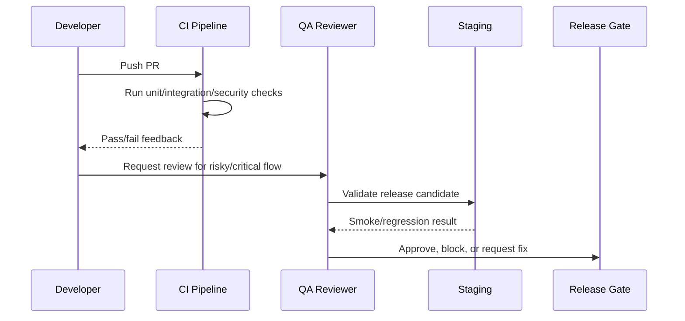

# Test Data and Fixtures

> *"Defines test data, fixtures, factories, fake users, fake organizations, fake workspaces, and privacy-safe demo data."*

---

# Purpose

Defines test data, fixtures, factories, fake users, fake organizations, fake workspaces, and privacy-safe demo data.

---

# Quality Problem

Using real data in tests or screenshots creates privacy risk, and random fixtures make tests flaky.

---

# Testing Decision

## Decision

CLARA test data must be fake, deterministic, scoped, reusable, and designed to test tenant/workspace isolation.

## Status

Accepted.

---

# Testing Implementation Rule

Every testable feature must be designed as:

```text
Requirement -> Risk -> Test Type -> Test Data -> Expected Result -> CI/QA Gate
```

Do not test only happy paths.

Do not rely only on manual testing.

Do not allow protected workflows to ship without authorization and scope tests.

---

# Recommended QA Flow



---

# Secure-by-Design Checklist

- [ ] Tests include unauthorized access cases.
- [ ] Tests include wrong organization/workspace cases.
- [ ] Tests include invalid input cases.
- [ ] Tests include safe error responses.
- [ ] Tests do not use real customer data.
- [ ] Tests do not require real secrets in CI.
- [ ] External providers are mocked/sandboxed.
- [ ] AI provider calls are mocked for deterministic tests.
- [ ] Critical journeys are covered.
- [ ] CI gate is clear.

---

# Acceptance Criteria

- [ ] Test objective is clear.
- [ ] Test layer is appropriate.
- [ ] Test data is safe.
- [ ] Security coverage is included where relevant.
- [ ] Failure behavior is tested.
- [ ] CI/QA ownership is defined.
- [ ] AI coding assistants can follow this safely.

---

# Anti-patterns

Avoid:

- Testing only happy paths.
- Relying on manual testing for every release.
- Using real customer data in tests.
- Calling real AI providers in normal CI.
- Calling real payment/integration providers in normal CI.
- Skipping authorization tests.
- Skipping migration tests.
- Building flaky E2E tests for every tiny behavior.
- Treating screenshots as proof of correctness.
- Marking bugs fixed without reproduction and verification.

---

# Related Documents

- ../PART-03-Backend-Implementation-Plan/README.md
- ../PART-04-Frontend-Implementation-Plan/README.md
- ../PART-05-Database-and-Migration-Plan/README.md
- ../PART-06-AI-Implementation-Plan/README.md
- ../PART-07-Integration-Implementation-Plan/README.md
- ../PART-08-Security-Implementation-Plan/README.md
- ../../BOOK-04-Product-Domain-Specification/BOOK-04-Master-Index/BOOK-04-MVP-SCOPE-MAP.md

---

# Navigation

**Previous:** `157-Backend-Testing-Execution.md`

**Next:** `159-Regression-Testing-and-Release-Candidate-Validation.md`

---

# Test Data Rules

Test data must be:

```text
fake
deterministic
small
scoped
easy to reset
privacy-safe
```

---

# Recommended Fixtures

```text
organization A
organization B
workspace A1
workspace A2
workspace B1
owner user
admin user
manager user
agent user
unauthorized user
customers in different workspaces
conversations in different workspaces
tickets in different workspaces
knowledge with draft/published/private states
```

---

# Privacy Rule

No real names, real emails, real phone numbers, real messages, real secrets, or production exports.
