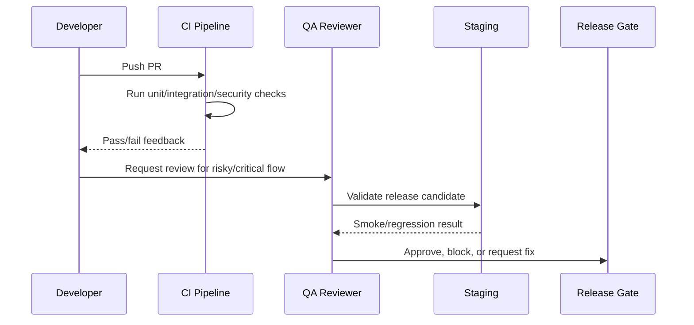

# QA Workflow and Bug Triage

> *"Defines QA workflow, bug reporting, severity levels, reproduction steps, triage rules, and fix verification."*

---

# Purpose

Defines QA workflow, bug reporting, severity levels, reproduction steps, triage rules, and fix verification.

---

# Quality Problem

Unstructured bug handling causes duplicate reports, unclear ownership, and risky releases.

---

# Testing Decision

## Decision

CLARA QA should use clear severity, reproducibility, ownership, and verification rules so bugs are handled consistently.

## Status

Accepted.

---

# Testing Implementation Rule

Every testable feature must be designed as:

```text
Requirement -> Risk -> Test Type -> Test Data -> Expected Result -> CI/QA Gate
```

Do not test only happy paths.

Do not rely only on manual testing.

Do not allow protected workflows to ship without authorization and scope tests.

---

# Recommended QA Flow



---

# Secure-by-Design Checklist

- [ ] Tests include unauthorized access cases.
- [ ] Tests include wrong organization/workspace cases.
- [ ] Tests include invalid input cases.
- [ ] Tests include safe error responses.
- [ ] Tests do not use real customer data.
- [ ] Tests do not require real secrets in CI.
- [ ] External providers are mocked/sandboxed.
- [ ] AI provider calls are mocked for deterministic tests.
- [ ] Critical journeys are covered.
- [ ] CI gate is clear.

---

# Acceptance Criteria

- [ ] Test objective is clear.
- [ ] Test layer is appropriate.
- [ ] Test data is safe.
- [ ] Security coverage is included where relevant.
- [ ] Failure behavior is tested.
- [ ] CI/QA ownership is defined.
- [ ] AI coding assistants can follow this safely.

---

# Anti-patterns

Avoid:

- Testing only happy paths.
- Relying on manual testing for every release.
- Using real customer data in tests.
- Calling real AI providers in normal CI.
- Calling real payment/integration providers in normal CI.
- Skipping authorization tests.
- Skipping migration tests.
- Building flaky E2E tests for every tiny behavior.
- Treating screenshots as proof of correctness.
- Marking bugs fixed without reproduction and verification.

---

# Related Documents

- ../PART-03-Backend-Implementation-Plan/README.md
- ../PART-04-Frontend-Implementation-Plan/README.md
- ../PART-05-Database-and-Migration-Plan/README.md
- ../PART-06-AI-Implementation-Plan/README.md
- ../PART-07-Integration-Implementation-Plan/README.md
- ../PART-08-Security-Implementation-Plan/README.md
- ../../BOOK-04-Product-Domain-Specification/BOOK-04-Master-Index/BOOK-04-MVP-SCOPE-MAP.md

---

# Navigation

**Previous:** `159-Regression-Testing-and-Release-Candidate-Validation.md`

**Next:** `161-Performance-and-Load-Testing-Baseline.md`

---

# Bug Report Template

Use:

```text
Title
Environment
Severity
Steps to reproduce
Expected behavior
Actual behavior
Screenshots/logs/request ID
User role
Organization/workspace context
Security/privacy impact
Regression? yes/no
```

---

# Severity Levels

| Severity | Meaning |
|---|---|
| S0 | Data loss, data leak, auth bypass, production outage |
| S1 | Critical workflow blocked, high security risk |
| S2 | Important workflow degraded |
| S3 | Minor bug or UX issue |
| S4 | Cosmetic/docs improvement |

---

# Fix Verification

A bug is fixed only when reproduction fails and a regression test exists where practical.
