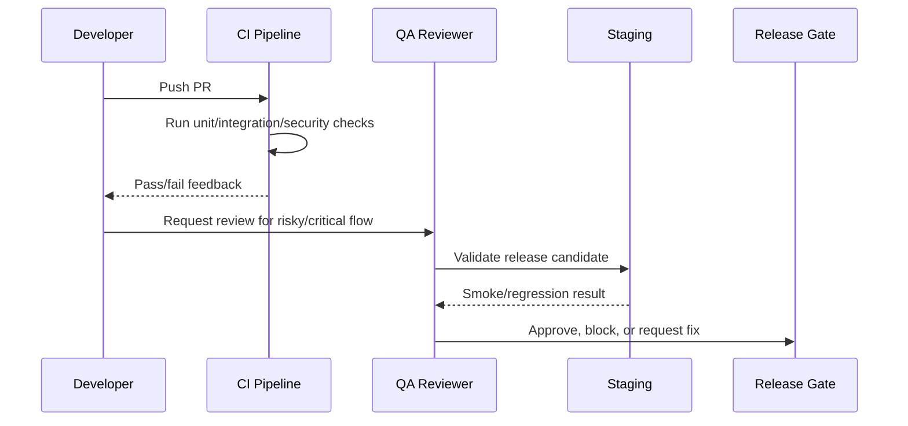

# Accessibility and UX QA

> *"Defines accessibility and UX quality checks for CLARA frontend workflows."*

---

# Purpose

Defines accessibility and UX quality checks for CLARA frontend workflows.

---

# Quality Problem

Poor accessibility and UX can block real users and cause operational mistakes.

---

# Testing Decision

## Decision

CLARA should include basic accessibility and UX checks for forms, navigation, modals, keyboard usage, contrast, labels, and error messaging.

## Status

Accepted.

---

# Testing Implementation Rule

Every testable feature must be designed as:

```text
Requirement -> Risk -> Test Type -> Test Data -> Expected Result -> CI/QA Gate
```

Do not test only happy paths.

Do not rely only on manual testing.

Do not allow protected workflows to ship without authorization and scope tests.

---

# Recommended QA Flow



---

# Secure-by-Design Checklist

- [ ] Tests include unauthorized access cases.
- [ ] Tests include wrong organization/workspace cases.
- [ ] Tests include invalid input cases.
- [ ] Tests include safe error responses.
- [ ] Tests do not use real customer data.
- [ ] Tests do not require real secrets in CI.
- [ ] External providers are mocked/sandboxed.
- [ ] AI provider calls are mocked for deterministic tests.
- [ ] Critical journeys are covered.
- [ ] CI gate is clear.

---

# Acceptance Criteria

- [ ] Test objective is clear.
- [ ] Test layer is appropriate.
- [ ] Test data is safe.
- [ ] Security coverage is included where relevant.
- [ ] Failure behavior is tested.
- [ ] CI/QA ownership is defined.
- [ ] AI coding assistants can follow this safely.

---

# Anti-patterns

Avoid:

- Testing only happy paths.
- Relying on manual testing for every release.
- Using real customer data in tests.
- Calling real AI providers in normal CI.
- Calling real payment/integration providers in normal CI.
- Skipping authorization tests.
- Skipping migration tests.
- Building flaky E2E tests for every tiny behavior.
- Treating screenshots as proof of correctness.
- Marking bugs fixed without reproduction and verification.

---

# Related Documents

- ../PART-03-Backend-Implementation-Plan/README.md
- ../PART-04-Frontend-Implementation-Plan/README.md
- ../PART-05-Database-and-Migration-Plan/README.md
- ../PART-06-AI-Implementation-Plan/README.md
- ../PART-07-Integration-Implementation-Plan/README.md
- ../PART-08-Security-Implementation-Plan/README.md
- ../../BOOK-04-Product-Domain-Specification/BOOK-04-Master-Index/BOOK-04-MVP-SCOPE-MAP.md

---

# Navigation

**Previous:** `161-Performance-and-Load-Testing-Baseline.md`

**Next:** `163-Observability-and-Production-Smoke-Tests.md`

---

# Accessibility Checks

Check:

```text
keyboard navigation
focus states
modal focus trap
form labels
error announcements
button names
table readability
color contrast basics
not relying on color only
screen-reader friendly loading/error states where practical
```

---

# UX QA Checks

Check:

```text
clear empty states
clear error states
safe confirmation on destructive actions
AI output labeling
internal vs customer-visible content distinction
unsaved changes warning where needed
```
