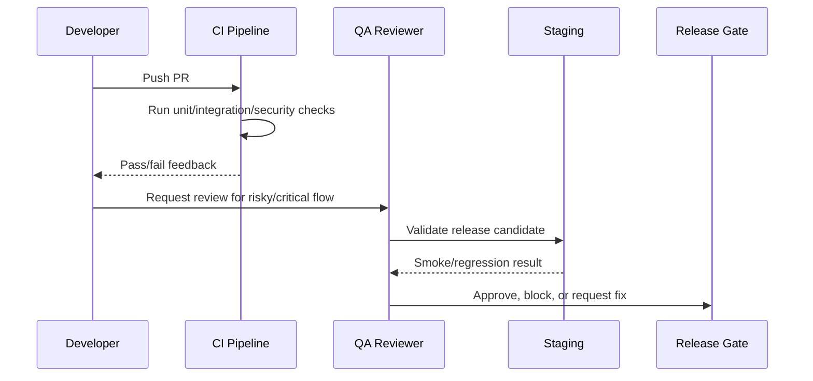

# Observability and Production Smoke Tests

> *"Defines smoke tests, health checks, post-deploy validation, synthetic checks, and observability-based QA."*

---

# Purpose

Defines smoke tests, health checks, post-deploy validation, synthetic checks, and observability-based QA.

---

# Quality Problem

Passing CI does not guarantee production runtime health.

---

# Testing Decision

## Decision

CLARA release validation should include smoke tests and operational checks that prove critical systems are alive after deployment.

## Status

Accepted.

---

# Testing Implementation Rule

Every testable feature must be designed as:

```text
Requirement -> Risk -> Test Type -> Test Data -> Expected Result -> CI/QA Gate
```

Do not test only happy paths.

Do not rely only on manual testing.

Do not allow protected workflows to ship without authorization and scope tests.

---

# Recommended QA Flow



---

# Secure-by-Design Checklist

- [ ] Tests include unauthorized access cases.
- [ ] Tests include wrong organization/workspace cases.
- [ ] Tests include invalid input cases.
- [ ] Tests include safe error responses.
- [ ] Tests do not use real customer data.
- [ ] Tests do not require real secrets in CI.
- [ ] External providers are mocked/sandboxed.
- [ ] AI provider calls are mocked for deterministic tests.
- [ ] Critical journeys are covered.
- [ ] CI gate is clear.

---

# Acceptance Criteria

- [ ] Test objective is clear.
- [ ] Test layer is appropriate.
- [ ] Test data is safe.
- [ ] Security coverage is included where relevant.
- [ ] Failure behavior is tested.
- [ ] CI/QA ownership is defined.
- [ ] AI coding assistants can follow this safely.

---

# Anti-patterns

Avoid:

- Testing only happy paths.
- Relying on manual testing for every release.
- Using real customer data in tests.
- Calling real AI providers in normal CI.
- Calling real payment/integration providers in normal CI.
- Skipping authorization tests.
- Skipping migration tests.
- Building flaky E2E tests for every tiny behavior.
- Treating screenshots as proof of correctness.
- Marking bugs fixed without reproduction and verification.

---

# Related Documents

- ../PART-03-Backend-Implementation-Plan/README.md
- ../PART-04-Frontend-Implementation-Plan/README.md
- ../PART-05-Database-and-Migration-Plan/README.md
- ../PART-06-AI-Implementation-Plan/README.md
- ../PART-07-Integration-Implementation-Plan/README.md
- ../PART-08-Security-Implementation-Plan/README.md
- ../../BOOK-04-Product-Domain-Specification/BOOK-04-Master-Index/BOOK-04-MVP-SCOPE-MAP.md

---

# Navigation

**Previous:** `162-Accessibility-and-UX-QA.md`

**Next:** `164-Test-Automation-and-CI-Gates.md`

---

# Smoke Test Targets

After deploy, validate:

```text
app loads
login works
workspace loads
customer list loads
conversation list loads
basic API health endpoint works
database connection works
worker health works if used
AI gateway health/degraded state works
integration health page works if enabled
audit event can be written/read where safe
```

---

# Observability QA

Confirm:

```text
request IDs appear
errors are logged safely
metrics update
audit events exist
no obvious secret leakage in logs
health checks reflect real state
```
