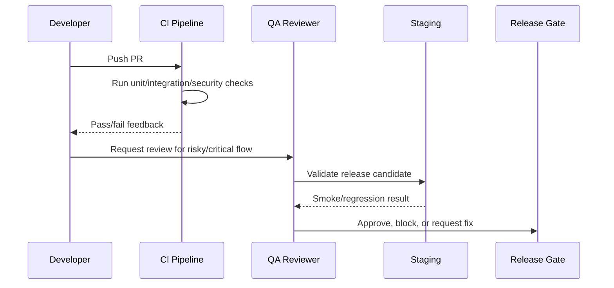

# Part 09 Summary

> *"Summarizes Testing and QA Execution and defines readiness to continue into DevOps and Release Execution."*

---

# Purpose

Summarizes Testing and QA Execution and defines readiness to continue into DevOps and Release Execution.

---

# Quality Problem

DevOps and release planning depends on reliable tests and QA gates so deployment can be controlled and trustworthy.

---

# Testing Decision

## Decision

CLARA should proceed to DevOps and Release Execution after test strategy, QA workflow, security tests, AI evaluation, integration tests, regression validation, and CI gates are defined.

## Status

Accepted.

---

# Testing Implementation Rule

Every testable feature must be designed as:

```text
Requirement -> Risk -> Test Type -> Test Data -> Expected Result -> CI/QA Gate
```

Do not test only happy paths.

Do not rely only on manual testing.

Do not allow protected workflows to ship without authorization and scope tests.

---

# Recommended QA Flow



---

# Secure-by-Design Checklist

- [ ] Tests include unauthorized access cases.
- [ ] Tests include wrong organization/workspace cases.
- [ ] Tests include invalid input cases.
- [ ] Tests include safe error responses.
- [ ] Tests do not use real customer data.
- [ ] Tests do not require real secrets in CI.
- [ ] External providers are mocked/sandboxed.
- [ ] AI provider calls are mocked for deterministic tests.
- [ ] Critical journeys are covered.
- [ ] CI gate is clear.

---

# Acceptance Criteria

- [ ] Test objective is clear.
- [ ] Test layer is appropriate.
- [ ] Test data is safe.
- [ ] Security coverage is included where relevant.
- [ ] Failure behavior is tested.
- [ ] CI/QA ownership is defined.
- [ ] AI coding assistants can follow this safely.

---

# Anti-patterns

Avoid:

- Testing only happy paths.
- Relying on manual testing for every release.
- Using real customer data in tests.
- Calling real AI providers in normal CI.
- Calling real payment/integration providers in normal CI.
- Skipping authorization tests.
- Skipping migration tests.
- Building flaky E2E tests for every tiny behavior.
- Treating screenshots as proof of correctness.
- Marking bugs fixed without reproduction and verification.

---

# Related Documents

- ../PART-03-Backend-Implementation-Plan/README.md
- ../PART-04-Frontend-Implementation-Plan/README.md
- ../PART-05-Database-and-Migration-Plan/README.md
- ../PART-06-AI-Implementation-Plan/README.md
- ../PART-07-Integration-Implementation-Plan/README.md
- ../PART-08-Security-Implementation-Plan/README.md
- ../../BOOK-04-Product-Domain-Specification/BOOK-04-Master-Index/BOOK-04-MVP-SCOPE-MAP.md

---

# Navigation

**Previous:** `164-Test-Automation-and-CI-Gates.md`

**Next:** `../PART-10-DevOps-and-Release-Execution/README.md`

---

# Part 09 Completion

Part 09 establishes:

- Testing strategy and test pyramid.
- Unit testing plan.
- Integration testing plan.
- API contract testing.
- E2E testing.
- Database and migration testing.
- Security testing.
- AI evaluation and testing.
- Integration/webhook testing.
- Frontend testing.
- Backend testing.
- Test data and fixtures.
- Regression and release candidate validation.
- QA workflow and bug triage.
- Performance/load baseline.
- Accessibility/UX QA.
- Observability and smoke tests.
- Test automation and CI gates.

---

# Ready for Part 10

The next part should be:

```text
BOOK V — PART 10: DevOps and Release Execution
```

It should define:

- Environment strategy.
- Deployment pipeline.
- Infrastructure baseline.
- Container/build strategy.
- Secrets in deployment.
- CI/CD workflow.
- Staging and production gates.
- Monitoring and alerting.
- Backup and restore.
- Incident response.
- Rollback strategy.
- Release notes and changelog.
