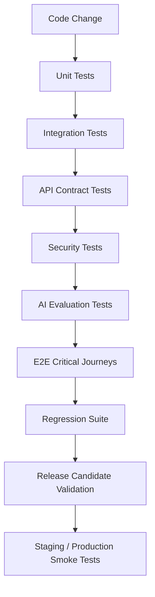

# PART-09 — Testing and QA Execution

> *"Testing is not just finding bugs. Testing is how CLARA proves it can be trusted."*

---

# Purpose

Part 09 defines how CLARA testing and QA should be executed across the product.

It covers:

- Testing strategy and test pyramid.
- Unit testing.
- Integration testing.
- API contract testing.
- End-to-end testing.
- Database and migration testing.
- Security testing.
- AI evaluation and testing.
- Integration and webhook testing.
- Frontend testing.
- Backend testing.
- Test data and fixtures.
- Regression testing and release candidate validation.
- QA workflow and bug triage.
- Performance and load testing baseline.
- Accessibility and UX QA.
- Observability and production smoke tests.
- Test automation and CI gates.

---

# Chapter Map

| Chapter | Title |
|---:|---|
| 146 | Testing and QA Execution Overview |
| 147 | Testing Strategy and Test Pyramid |
| 148 | Unit Testing Plan |
| 149 | Integration Testing Plan |
| 150 | API Contract Testing Plan |
| 151 | End to End Testing Plan |
| 152 | Database and Migration Testing |
| 153 | Security Testing Execution |
| 154 | AI Evaluation and Testing |
| 155 | Integration and Webhook Testing |
| 156 | Frontend Testing Execution |
| 157 | Backend Testing Execution |
| 158 | Test Data and Fixtures |
| 159 | Regression Testing and Release Candidate Validation |
| 160 | QA Workflow and Bug Triage |
| 161 | Performance and Load Testing Baseline |
| 162 | Accessibility and UX QA |
| 163 | Observability and Production Smoke Tests |
| 164 | Test Automation and CI Gates |
| 165 | Part 09 Summary |

---

# Testing Execution Map



---

# Testing Non-Negotiables

CLARA testing must enforce:

```text
Authorization tests for protected actions
Cross-tenant and cross-workspace isolation tests
Input validation tests
Safe error response tests
Migration tests
Critical frontend journey tests
AI context boundary tests
AI prompt injection scenario tests
Webhook signature/idempotency tests
No real customer data in tests
CI gates before merge
Smoke tests before/after release
```

---

# MVP Testing Scope

MVP must include:

```text
Unit tests for domain logic
Backend integration tests for core APIs
Authorization and scope tests
Frontend critical flow tests
Database migration tests
Webhook/channel ingestion tests if integrations exist
AI Gateway tests with mocked provider
AI reply draft evaluation scenarios
Security regression tests
Release candidate checklist
Smoke tests
```

MVP may defer:

```text
Large-scale chaos testing
Full visual regression platform
Enterprise compliance test automation
Full load testing suite
Dedicated QA automation framework
Advanced AI benchmark platform
```

---

# Navigation

**Previous:** `../PART-08-Security-Implementation-Plan/145-Part-08-Summary.md`

**Next:** `146-Testing-and-QA-Execution-Overview.md`
