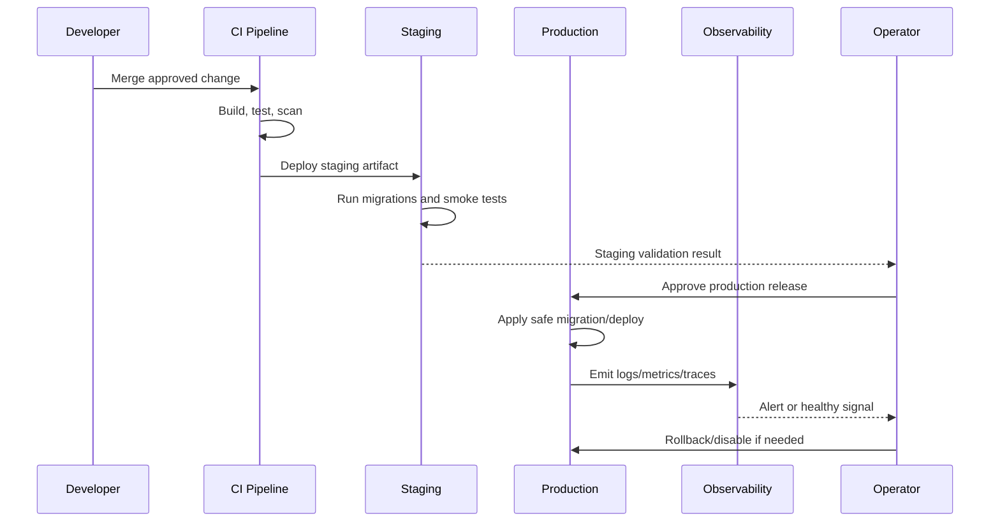

# DevOps and Release Execution Overview

> *"Defines DevOps and release execution plan for CLARA across environments, CI/CD, infrastructure, deployment, monitoring, rollback, incident response, and release governance."*

---

# Purpose

Defines DevOps and release execution plan for CLARA across environments, CI/CD, infrastructure, deployment, monitoring, rollback, incident response, and release governance.

---

# Operations Problem

Without DevOps discipline, CLARA can ship untested code, leak secrets, break migrations, lose data, or fail silently in production.

---

# DevOps Decision

## Decision

CLARA DevOps should be implemented as a controlled release system with reproducible builds, environment separation, secrets protection, deployment gates, observability, backups, and rollback paths.

## Status

Accepted.

---

# DevOps Implementation Rule

Every production-facing change must be designed as:

```text
Build -> Test -> Package -> Configure -> Deploy -> Validate -> Monitor -> Rollback/Recover
```

Do not treat deployment as file copying.

Do not treat CI passing as proof that production is healthy.

Do not deploy features that cannot be observed, disabled, or recovered.

---

# Recommended Release Flow



---

# Secure-by-Design Checklist

- [ ] Environment separation is clear.
- [ ] Secrets are environment-specific.
- [ ] Production secrets are not in code/docs/logs.
- [ ] CI gates run before merge/deploy.
- [ ] Build artifact is reproducible.
- [ ] Migrations are tested.
- [ ] Deployment has rollback or forward-fix path.
- [ ] Monitoring and alerts exist for critical paths.
- [ ] Logs are redacted.
- [ ] Backups exist and restore is tested.
- [ ] Incident response owner is clear.
- [ ] Release notes are prepared where needed.

---

# Acceptance Criteria

- [ ] Deployment behavior is clear.
- [ ] Security requirements are explicit.
- [ ] Operational ownership is defined.
- [ ] Monitoring expectations are included.
- [ ] Rollback/recovery expectations are included.
- [ ] MVP and future maturity are separated.
- [ ] AI coding assistants can follow this safely.

---

# Anti-patterns

Avoid:

- Manual production changes without tracking.
- Same secrets across dev/staging/prod.
- Deploying untested migrations.
- Running production with debug mode.
- Logging secrets or raw sensitive payloads.
- Relying on screenshots instead of smoke tests.
- No rollback plan.
- No backup restore test.
- Alerts that nobody owns.
- Runbooks that are never updated.

---

# Related Documents

- ../PART-02-Repository-and-Development-Workflow/README.md
- ../PART-05-Database-and-Migration-Plan/README.md
- ../PART-08-Security-Implementation-Plan/README.md
- ../PART-09-Testing-and-QA-Execution/README.md
- ../../BOOK-04-Product-Domain-Specification/BOOK-04-Master-Index/BOOK-04-MVP-SCOPE-MAP.md

---

# Navigation

**Previous:** `../PART-09-Testing-and-QA-Execution/165-Part-09-Summary.md`

**Next:** `167-Environment-Strategy.md`

---

# DevOps MVP Build Order

Recommended order:

```text
1. Define environments
2. Create CI pipeline
3. Build API/web/worker artifacts
4. Configure secret handling
5. Deploy to staging
6. Run migrations safely
7. Add smoke tests
8. Add basic logs/metrics
9. Configure backups
10. Define rollback/disable procedure
11. Create release checklist
12. Create initial runbooks
```

---

# Operational Ownership

Even if CLARA starts small, ownership must be explicit:

```text
who deploys
who approves
who monitors
who handles incidents
who rotates secrets
who verifies backups
who updates runbooks
```
