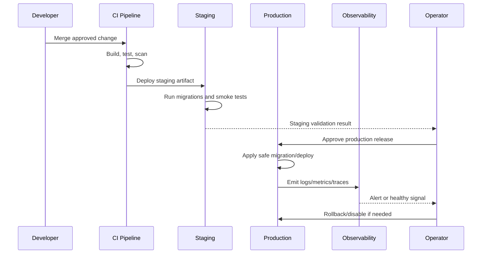

# Database Migration Release Execution

> *"Defines how database migrations should be executed safely during releases."*

---

# Purpose

Defines how database migrations should be executed safely during releases.

---

# Operations Problem

Database migrations are one of the highest-risk release steps because failures can corrupt data or block production.

---

# DevOps Decision

## Decision

CLARA database migrations should be tested, reviewed, backed up when risky, executed with clear ordering, monitored, and designed for rollback or forward-fix.

## Status

Accepted.

---

# DevOps Implementation Rule

Every production-facing change must be designed as:

```text
Build -> Test -> Package -> Configure -> Deploy -> Validate -> Monitor -> Rollback/Recover
```

Do not treat deployment as file copying.

Do not treat CI passing as proof that production is healthy.

Do not deploy features that cannot be observed, disabled, or recovered.

---

# Recommended Release Flow



---

# Secure-by-Design Checklist

- [ ] Environment separation is clear.
- [ ] Secrets are environment-specific.
- [ ] Production secrets are not in code/docs/logs.
- [ ] CI gates run before merge/deploy.
- [ ] Build artifact is reproducible.
- [ ] Migrations are tested.
- [ ] Deployment has rollback or forward-fix path.
- [ ] Monitoring and alerts exist for critical paths.
- [ ] Logs are redacted.
- [ ] Backups exist and restore is tested.
- [ ] Incident response owner is clear.
- [ ] Release notes are prepared where needed.

---

# Acceptance Criteria

- [ ] Deployment behavior is clear.
- [ ] Security requirements are explicit.
- [ ] Operational ownership is defined.
- [ ] Monitoring expectations are included.
- [ ] Rollback/recovery expectations are included.
- [ ] MVP and future maturity are separated.
- [ ] AI coding assistants can follow this safely.

---

# Anti-patterns

Avoid:

- Manual production changes without tracking.
- Same secrets across dev/staging/prod.
- Deploying untested migrations.
- Running production with debug mode.
- Logging secrets or raw sensitive payloads.
- Relying on screenshots instead of smoke tests.
- No rollback plan.
- No backup restore test.
- Alerts that nobody owns.
- Runbooks that are never updated.

---

# Related Documents

- ../PART-02-Repository-and-Development-Workflow/README.md
- ../PART-05-Database-and-Migration-Plan/README.md
- ../PART-08-Security-Implementation-Plan/README.md
- ../PART-09-Testing-and-QA-Execution/README.md
- ../../BOOK-04-Product-Domain-Specification/BOOK-04-Master-Index/BOOK-04-MVP-SCOPE-MAP.md

---

# Navigation

**Previous:** `172-Secrets-and-Configuration-in-Deployment.md`

**Next:** `174-Staging-and-Production-Gates.md`

---

# Migration Release Steps

Recommended:

```text
1. Review migration PR
2. Run migration locally
3. Run migration in CI
4. Apply to staging
5. Validate staging smoke/regression
6. Backup production if risky
7. Apply production migration
8. Monitor errors/latency
9. Verify application behavior
```

---

# Risky Migration Examples

```text
drop column/table
backfill large data
add non-null constraint
add unique constraint to existing data
large index creation
change enum/status behavior
```

Risky migrations require extra review and rollback/forward-fix plan.
