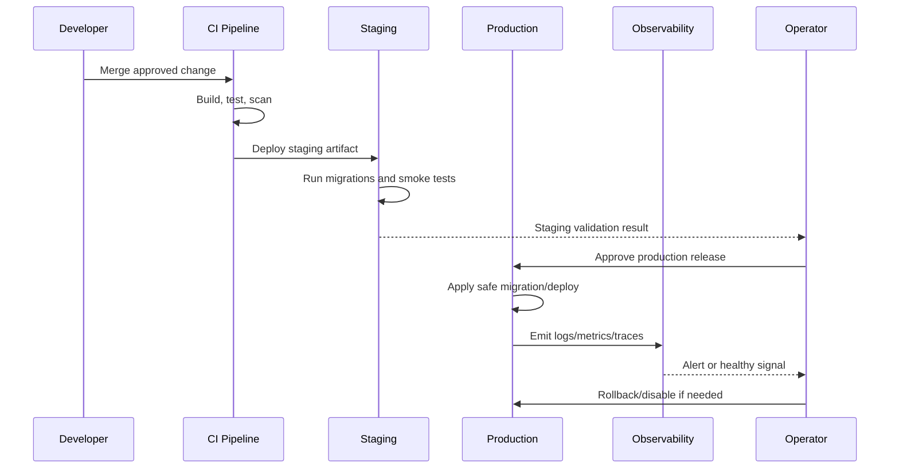

# Deployment Strategy

> *"Defines release deployment strategies such as rolling, blue-green, canary, maintenance window, and feature-flagged rollout."*

---

# Purpose

Defines release deployment strategies such as rolling, blue-green, canary, maintenance window, and feature-flagged rollout.

---

# Operations Problem

Choosing complex deployment patterns too early adds operational burden, but having no rollback path is dangerous.

---

# DevOps Decision

## Decision

CLARA should start with simple safe deployments and feature flags, then evolve toward advanced rollout patterns as production maturity grows.

## Status

Accepted.

---

# DevOps Implementation Rule

Every production-facing change must be designed as:

```text
Build -> Test -> Package -> Configure -> Deploy -> Validate -> Monitor -> Rollback/Recover
```

Do not treat deployment as file copying.

Do not treat CI passing as proof that production is healthy.

Do not deploy features that cannot be observed, disabled, or recovered.

---

# Recommended Release Flow



---

# Secure-by-Design Checklist

- [ ] Environment separation is clear.
- [ ] Secrets are environment-specific.
- [ ] Production secrets are not in code/docs/logs.
- [ ] CI gates run before merge/deploy.
- [ ] Build artifact is reproducible.
- [ ] Migrations are tested.
- [ ] Deployment has rollback or forward-fix path.
- [ ] Monitoring and alerts exist for critical paths.
- [ ] Logs are redacted.
- [ ] Backups exist and restore is tested.
- [ ] Incident response owner is clear.
- [ ] Release notes are prepared where needed.

---

# Acceptance Criteria

- [ ] Deployment behavior is clear.
- [ ] Security requirements are explicit.
- [ ] Operational ownership is defined.
- [ ] Monitoring expectations are included.
- [ ] Rollback/recovery expectations are included.
- [ ] MVP and future maturity are separated.
- [ ] AI coding assistants can follow this safely.

---

# Anti-patterns

Avoid:

- Manual production changes without tracking.
- Same secrets across dev/staging/prod.
- Deploying untested migrations.
- Running production with debug mode.
- Logging secrets or raw sensitive payloads.
- Relying on screenshots instead of smoke tests.
- No rollback plan.
- No backup restore test.
- Alerts that nobody owns.
- Runbooks that are never updated.

---

# Related Documents

- ../PART-02-Repository-and-Development-Workflow/README.md
- ../PART-05-Database-and-Migration-Plan/README.md
- ../PART-08-Security-Implementation-Plan/README.md
- ../PART-09-Testing-and-QA-Execution/README.md
- ../../BOOK-04-Product-Domain-Specification/BOOK-04-Master-Index/BOOK-04-MVP-SCOPE-MAP.md

---

# Navigation

**Previous:** `174-Staging-and-Production-Gates.md`

**Next:** `176-Feature-Flag-and-Rollout-Execution.md`

---

# Deployment Strategy Options

| Strategy | Use When | Trade-off |
|---|---|---|
| Simple rolling deploy | MVP/basic services | Simple but brief mixed versions |
| Blue-green | Need quick switch/rollback | More infra cost/complexity |
| Canary | Gradual production exposure | Needs strong monitoring |
| Feature flag rollout | Risky product feature | Requires flag discipline |
| Maintenance window | Risky migration | User disruption |

---

# MVP Recommendation

Start with:

```text
staging deploy
production deploy
feature flags for risky features
manual approval for production
clear rollback/disable path
```
