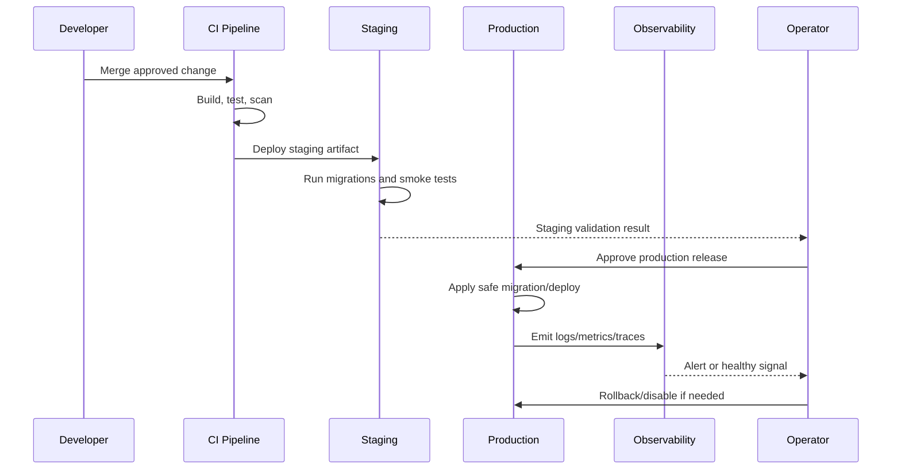

# Feature Flag and Rollout Execution

> *"Defines feature flag usage for progressive rollout, environment gating, risky features, AI, integrations, and admin controls."*

---

# Purpose

Defines feature flag usage for progressive rollout, environment gating, risky features, AI, integrations, and admin controls.

---

# Operations Problem

Without rollout controls, every release becomes all-or-nothing and harder to rollback safely.

---

# DevOps Decision

## Decision

CLARA should use feature flags for risky or staged features while avoiding permanent flag clutter.

## Status

Accepted.

---

# DevOps Implementation Rule

Every production-facing change must be designed as:

```text
Build -> Test -> Package -> Configure -> Deploy -> Validate -> Monitor -> Rollback/Recover
```

Do not treat deployment as file copying.

Do not treat CI passing as proof that production is healthy.

Do not deploy features that cannot be observed, disabled, or recovered.

---

# Recommended Release Flow



---

# Secure-by-Design Checklist

- [ ] Environment separation is clear.
- [ ] Secrets are environment-specific.
- [ ] Production secrets are not in code/docs/logs.
- [ ] CI gates run before merge/deploy.
- [ ] Build artifact is reproducible.
- [ ] Migrations are tested.
- [ ] Deployment has rollback or forward-fix path.
- [ ] Monitoring and alerts exist for critical paths.
- [ ] Logs are redacted.
- [ ] Backups exist and restore is tested.
- [ ] Incident response owner is clear.
- [ ] Release notes are prepared where needed.

---

# Acceptance Criteria

- [ ] Deployment behavior is clear.
- [ ] Security requirements are explicit.
- [ ] Operational ownership is defined.
- [ ] Monitoring expectations are included.
- [ ] Rollback/recovery expectations are included.
- [ ] MVP and future maturity are separated.
- [ ] AI coding assistants can follow this safely.

---

# Anti-patterns

Avoid:

- Manual production changes without tracking.
- Same secrets across dev/staging/prod.
- Deploying untested migrations.
- Running production with debug mode.
- Logging secrets or raw sensitive payloads.
- Relying on screenshots instead of smoke tests.
- No rollback plan.
- No backup restore test.
- Alerts that nobody owns.
- Runbooks that are never updated.

---

# Related Documents

- ../PART-02-Repository-and-Development-Workflow/README.md
- ../PART-05-Database-and-Migration-Plan/README.md
- ../PART-08-Security-Implementation-Plan/README.md
- ../PART-09-Testing-and-QA-Execution/README.md
- ../../BOOK-04-Product-Domain-Specification/BOOK-04-Master-Index/BOOK-04-MVP-SCOPE-MAP.md

---

# Navigation

**Previous:** `175-Deployment-Strategy.md`

**Next:** `177-Monitoring-and-Alerting-Baseline.md`

---

# Feature Flag Use Cases

Use flags for:

```text
AI features
new integration providers
workflow automation actions
billing/admin controls
new dashboards
high-risk UI flows
beta modules
```

---

# Flag Rules

- Flags must have owner.
- Flags must have cleanup date or decision point.
- Do not leave stale flags forever.
- Critical security controls should not depend only on frontend flags.
- Backend must enforce feature availability/entitlements.
