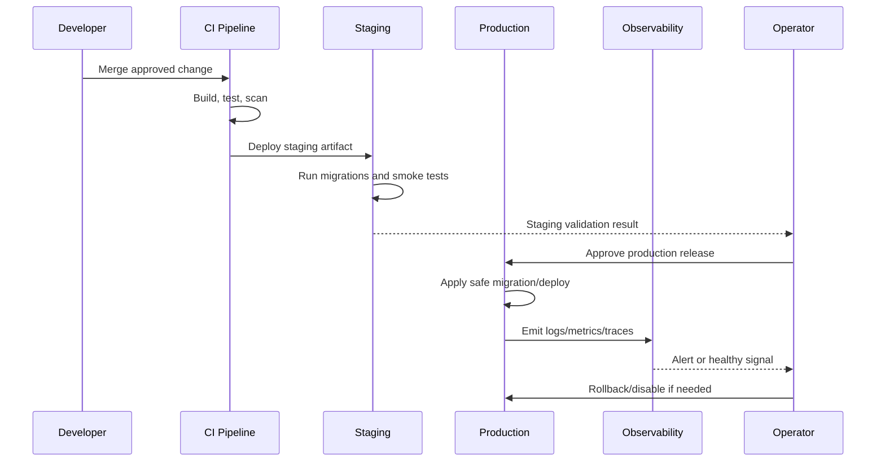

# Backup and Restore Strategy

> *"Defines backup, restore, disaster recovery, and restore testing strategy."*

---

# Purpose

Defines backup, restore, disaster recovery, and restore testing strategy.

---

# Operations Problem

Backups that are never tested are assumptions, not recovery plans.

---

# DevOps Decision

## Decision

CLARA must define backup frequency, retention, restore process, restore testing, and data-loss expectations before production use.

## Status

Accepted.

---

# DevOps Implementation Rule

Every production-facing change must be designed as:

```text
Build -> Test -> Package -> Configure -> Deploy -> Validate -> Monitor -> Rollback/Recover
```

Do not treat deployment as file copying.

Do not treat CI passing as proof that production is healthy.

Do not deploy features that cannot be observed, disabled, or recovered.

---

# Recommended Release Flow



---

# Secure-by-Design Checklist

- [ ] Environment separation is clear.
- [ ] Secrets are environment-specific.
- [ ] Production secrets are not in code/docs/logs.
- [ ] CI gates run before merge/deploy.
- [ ] Build artifact is reproducible.
- [ ] Migrations are tested.
- [ ] Deployment has rollback or forward-fix path.
- [ ] Monitoring and alerts exist for critical paths.
- [ ] Logs are redacted.
- [ ] Backups exist and restore is tested.
- [ ] Incident response owner is clear.
- [ ] Release notes are prepared where needed.

---

# Acceptance Criteria

- [ ] Deployment behavior is clear.
- [ ] Security requirements are explicit.
- [ ] Operational ownership is defined.
- [ ] Monitoring expectations are included.
- [ ] Rollback/recovery expectations are included.
- [ ] MVP and future maturity are separated.
- [ ] AI coding assistants can follow this safely.

---

# Anti-patterns

Avoid:

- Manual production changes without tracking.
- Same secrets across dev/staging/prod.
- Deploying untested migrations.
- Running production with debug mode.
- Logging secrets or raw sensitive payloads.
- Relying on screenshots instead of smoke tests.
- No rollback plan.
- No backup restore test.
- Alerts that nobody owns.
- Runbooks that are never updated.

---

# Related Documents

- ../PART-02-Repository-and-Development-Workflow/README.md
- ../PART-05-Database-and-Migration-Plan/README.md
- ../PART-08-Security-Implementation-Plan/README.md
- ../PART-09-Testing-and-QA-Execution/README.md
- ../../BOOK-04-Product-Domain-Specification/BOOK-04-Master-Index/BOOK-04-MVP-SCOPE-MAP.md

---

# Navigation

**Previous:** `178-Logging-Tracing-and-Metrics-Execution.md`

**Next:** `180-Incident-Response-Execution.md`

---

# Backup Requirements

Define:

```text
backup frequency
backup retention
storage location
encryption
restore owner
restore procedure
restore testing frequency
RPO
RTO
```

---

# Restore Testing

At minimum, test restore to a non-production environment.

A backup is not trustworthy until restore has been tested.

---

# Data Coverage

Back up:

```text
database
object storage metadata/files where relevant
configuration references where needed
```

Do not rely on app code backups as data backups.
