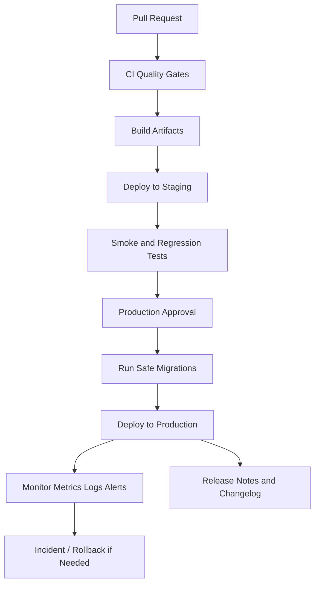

# PART-10 — DevOps and Release Execution

> *"Shipping is not the end of engineering. Shipping is where engineering promises meet production reality."*

---

# Purpose

Part 10 defines how CLARA should be built, deployed, monitored, recovered, and released.

It covers:

- Environment strategy.
- Build and artifact strategy.
- Container and runtime strategy.
- Infrastructure baseline.
- CI/CD pipeline execution.
- Secrets and configuration in deployment.
- Database migration release execution.
- Staging and production gates.
- Deployment strategy.
- Feature flag and rollout execution.
- Monitoring and alerting baseline.
- Logging, tracing, and metrics execution.
- Backup and restore strategy.
- Incident response execution.
- Rollback and recovery strategy.
- Release notes and changelog workflow.
- Operational runbook execution.
- Production readiness gates.

---

# Chapter Map

| Chapter | Title |
|---:|---|
| 166 | DevOps and Release Execution Overview |
| 167 | Environment Strategy |
| 168 | Build and Artifact Strategy |
| 169 | Container and Runtime Strategy |
| 170 | Infrastructure Baseline |
| 171 | CI CD Pipeline Execution |
| 172 | Secrets and Configuration in Deployment |
| 173 | Database Migration Release Execution |
| 174 | Staging and Production Gates |
| 175 | Deployment Strategy |
| 176 | Feature Flag and Rollout Execution |
| 177 | Monitoring and Alerting Baseline |
| 178 | Logging Tracing and Metrics Execution |
| 179 | Backup and Restore Strategy |
| 180 | Incident Response Execution |
| 181 | Rollback and Recovery Strategy |
| 182 | Release Notes and Changelog Workflow |
| 183 | Operational Runbook Execution |
| 184 | Production Readiness Gates |
| 185 | Part 10 Summary |

---

# DevOps Execution Map



---

# DevOps Non-Negotiables

CLARA DevOps must enforce:

```text
No production deploy without passing CI
No production secrets in source code
No real secrets in frontend bundle
No untested database migrations
No production release without rollback/forward-fix plan
No silent failure for critical jobs
No release without basic monitoring
No backup strategy without restore testing
No high-risk release without staging validation
No incident without postmortem for significant failures
```

---

# MVP DevOps Scope

MVP must include:

```text
local/test/staging/production environment separation
CI pipeline
reproducible build
safe environment variables
deployment workflow
migration execution workflow
basic logs
basic metrics
basic alerts
database backup plan
rollback/disable strategy
release checklist
operational runbooks
```

MVP may defer:

```text
multi-region deployment
advanced autoscaling
full chaos testing
enterprise-grade SRE automation
advanced canary platform
dedicated on-call rotation
full compliance reporting automation
```

---

# Navigation

**Previous:** `../PART-09-Testing-and-QA-Execution/165-Part-09-Summary.md`

**Next:** `166-DevOps-and-Release-Execution-Overview.md`
