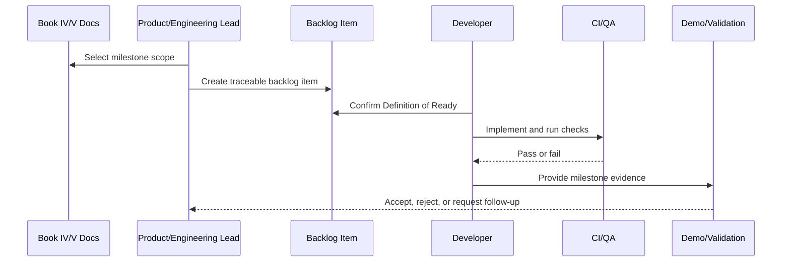

# MVP Milestone Strategy

> *"Defines the milestone strategy for building CLARA in dependency order and validating vertical slices."*

---

# Purpose

Defines the milestone strategy for building CLARA in dependency order and validating vertical slices.

---

# Execution Problem

Building exciting modules first, such as AI or automation, before foundations creates high security and rework risk.

---

# Milestone Decision

## Decision

CLARA milestones should follow product and technical dependency order: foundation, CRM, inbox, knowledge, AI, ticketing, integrations, admin/audit/analytics, workflow, and readiness.

## Status

Accepted.

---

# Backlog Implementation Rule

Every backlog item must be designed as:

```text
Document Reference -> User/Technical Goal -> Scope -> Acceptance Criteria -> Security/Test Gates -> Demo Evidence
```

A task is not ready if it cannot be tested, reviewed, and connected to a documented CLARA domain.

---

# Recommended Backlog Flow



---

# Secure-by-Design Checklist

- [ ] Related Book IV domain is referenced.
- [ ] Related Book V execution plan is referenced.
- [ ] Authentication/authorization impact is considered.
- [ ] Organization/workspace scope is considered.
- [ ] Input validation is considered.
- [ ] Output safety is considered.
- [ ] Audit/security event need is considered.
- [ ] Test expectations are defined.
- [ ] Rollback/disable strategy is considered for risky work.
- [ ] Demo evidence is defined.

---

# Acceptance Criteria

- [ ] Milestone scope is clear.
- [ ] MVP vs post-MVP boundary is clear.
- [ ] Dependencies are identified.
- [ ] Backlog items can be created from this chapter.
- [ ] Security and QA gates are included.
- [ ] Demo/validation evidence is clear.
- [ ] AI coding assistants can follow this safely.

---

# Anti-patterns

Avoid:

- Backlog items like “build CRM” or “add AI”.
- Building modules out of dependency order.
- Marking a milestone complete without tests.
- Treating AI-generated code as reviewed.
- Skipping docs updates.
- Adding features outside MVP without explicit decision.
- Ignoring security and quality gates.
- Leaving acceptance criteria vague.
- Completing isolated screens without end-to-end workflow.

---

# Related Documents

- ../PART-01-Execution-Strategy/README.md
- ../PART-02-Repository-and-Development-Workflow/README.md
- ../PART-03-Backend-Implementation-Plan/README.md
- ../PART-04-Frontend-Implementation-Plan/README.md
- ../PART-08-Security-Implementation-Plan/README.md
- ../PART-09-Testing-and-QA-Execution/README.md
- ../PART-10-DevOps-and-Release-Execution/README.md
- ../../BOOK-04-Product-Domain-Specification/BOOK-04-Master-Index/BOOK-04-MVP-SCOPE-MAP.md

---

# Navigation

**Previous:** `186-MVP-Milestones-and-Backlog-Overview.md`

**Next:** `188-Phase-0-Repo-and-Docs-Hygiene.md`

---

# Milestone Strategy

Use dependency order:

```text
Phase 0: repo/docs/tooling
Phase 1: identity and scope
Phase 2: CRM
Phase 3: inbox
Phase 4: knowledge
Phase 5: AI reply drafting
Phase 6: ticketing
Phase 7: integrations/channels
Phase 8: admin/audit/analytics/settings
Phase 9: workflow automation baseline
Phase 10: production readiness/handover
```

---

# Milestone Rule

Each milestone must produce:

```text
usable feature slice
tests
docs update
security review where needed
demo evidence
known limitations
```
