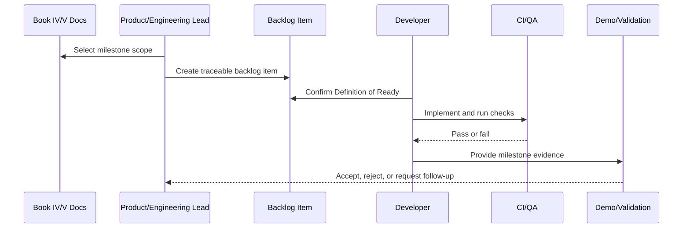

# Phase 0 Repo and Docs Hygiene

> *"Defines cleanup, repository alignment, documentation validation, AGENTS.md setup, and baseline tooling before coding begins."*

---

# Purpose

Defines cleanup, repository alignment, documentation validation, AGENTS.md setup, and baseline tooling before coding begins.

---

# Execution Problem

A messy repo and inconsistent docs cause AI coding assistants and developers to make wrong assumptions.

---

# Milestone Decision

## Decision

CLARA should start implementation only after repo structure, docs references, naming consistency, and AI coding assistant instructions are aligned.

## Status

Accepted.

---

# Backlog Implementation Rule

Every backlog item must be designed as:

```text
Document Reference -> User/Technical Goal -> Scope -> Acceptance Criteria -> Security/Test Gates -> Demo Evidence
```

A task is not ready if it cannot be tested, reviewed, and connected to a documented CLARA domain.

---

# Recommended Backlog Flow



---

# Secure-by-Design Checklist

- [ ] Related Book IV domain is referenced.
- [ ] Related Book V execution plan is referenced.
- [ ] Authentication/authorization impact is considered.
- [ ] Organization/workspace scope is considered.
- [ ] Input validation is considered.
- [ ] Output safety is considered.
- [ ] Audit/security event need is considered.
- [ ] Test expectations are defined.
- [ ] Rollback/disable strategy is considered for risky work.
- [ ] Demo evidence is defined.

---

# Acceptance Criteria

- [ ] Milestone scope is clear.
- [ ] MVP vs post-MVP boundary is clear.
- [ ] Dependencies are identified.
- [ ] Backlog items can be created from this chapter.
- [ ] Security and QA gates are included.
- [ ] Demo/validation evidence is clear.
- [ ] AI coding assistants can follow this safely.

---

# Anti-patterns

Avoid:

- Backlog items like “build CRM” or “add AI”.
- Building modules out of dependency order.
- Marking a milestone complete without tests.
- Treating AI-generated code as reviewed.
- Skipping docs updates.
- Adding features outside MVP without explicit decision.
- Ignoring security and quality gates.
- Leaving acceptance criteria vague.
- Completing isolated screens without end-to-end workflow.

---

# Related Documents

- ../PART-01-Execution-Strategy/README.md
- ../PART-02-Repository-and-Development-Workflow/README.md
- ../PART-03-Backend-Implementation-Plan/README.md
- ../PART-04-Frontend-Implementation-Plan/README.md
- ../PART-08-Security-Implementation-Plan/README.md
- ../PART-09-Testing-and-QA-Execution/README.md
- ../PART-10-DevOps-and-Release-Execution/README.md
- ../../BOOK-04-Product-Domain-Specification/BOOK-04-Master-Index/BOOK-04-MVP-SCOPE-MAP.md

---

# Navigation

**Previous:** `187-MVP-Milestone-Strategy.md`

**Next:** `189-Phase-1-Foundation-Auth-Organization-Workspace.md`

---

# Phase 0 Scope

Tasks:

```text
finalize repo folder structure
add/update root README
add/update docs README
add Book IV and Book V docs
create root AGENTS.md
create apps/api AGENTS.md
create apps/web AGENTS.md
create docs AGENTS.md
set package manager
add formatting/lint baseline
add .env.example
add .gitignore
add PR template
add issue templates
```

---

# Phase 0 Acceptance

- [ ] Repository structure is clear.
- [ ] CLARA naming is consistent.
- [ ] Old Athena references are removed or intentionally historical.
- [ ] Documentation paths are valid.
- [ ] AI coding assistants have instructions.
- [ ] Local setup docs exist.
