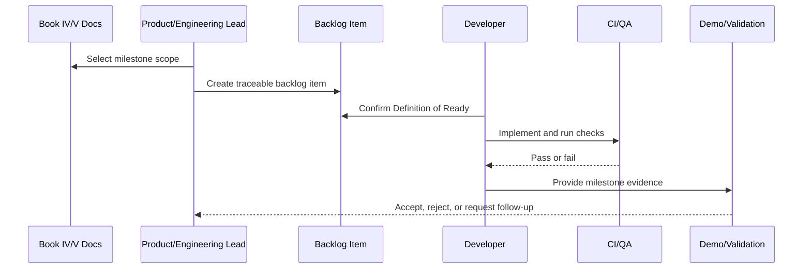

# MVP Demo and Validation Plan

> *"Defines how CLARA MVP should be demonstrated, validated, and accepted by stakeholders."*

---

# Purpose

Defines how CLARA MVP should be demonstrated, validated, and accepted by stakeholders.

---

# Execution Problem

A demo that only shows isolated screens does not prove the product workflow is real.

---

# Milestone Decision

## Decision

CLARA MVP demo should prove a complete operational flow from workspace setup to customer conversation, AI-assisted reply, ticket creation, audit, and analytics.

## Status

Accepted.

---

# Backlog Implementation Rule

Every backlog item must be designed as:

```text
Document Reference -> User/Technical Goal -> Scope -> Acceptance Criteria -> Security/Test Gates -> Demo Evidence
```

A task is not ready if it cannot be tested, reviewed, and connected to a documented CLARA domain.

---

# Recommended Backlog Flow



---

# Secure-by-Design Checklist

- [ ] Related Book IV domain is referenced.
- [ ] Related Book V execution plan is referenced.
- [ ] Authentication/authorization impact is considered.
- [ ] Organization/workspace scope is considered.
- [ ] Input validation is considered.
- [ ] Output safety is considered.
- [ ] Audit/security event need is considered.
- [ ] Test expectations are defined.
- [ ] Rollback/disable strategy is considered for risky work.
- [ ] Demo evidence is defined.

---

# Acceptance Criteria

- [ ] Milestone scope is clear.
- [ ] MVP vs post-MVP boundary is clear.
- [ ] Dependencies are identified.
- [ ] Backlog items can be created from this chapter.
- [ ] Security and QA gates are included.
- [ ] Demo/validation evidence is clear.
- [ ] AI coding assistants can follow this safely.

---

# Anti-patterns

Avoid:

- Backlog items like “build CRM” or “add AI”.
- Building modules out of dependency order.
- Marking a milestone complete without tests.
- Treating AI-generated code as reviewed.
- Skipping docs updates.
- Adding features outside MVP without explicit decision.
- Ignoring security and quality gates.
- Leaving acceptance criteria vague.
- Completing isolated screens without end-to-end workflow.

---

# Related Documents

- ../PART-01-Execution-Strategy/README.md
- ../PART-02-Repository-and-Development-Workflow/README.md
- ../PART-03-Backend-Implementation-Plan/README.md
- ../PART-04-Frontend-Implementation-Plan/README.md
- ../PART-08-Security-Implementation-Plan/README.md
- ../PART-09-Testing-and-QA-Execution/README.md
- ../PART-10-DevOps-and-Release-Execution/README.md
- ../../BOOK-04-Product-Domain-Specification/BOOK-04-Master-Index/BOOK-04-MVP-SCOPE-MAP.md

---

# Navigation

**Previous:** `203-Security-and-Quality-Gates-per-Milestone.md`

**Next:** `205-Part-11-Summary.md`

---

# MVP Demo Script Outline

Demo should show:

```text
1. Admin signs in
2. Admin selects workspace
3. Admin confirms users/roles
4. Agent creates customer
5. Customer message appears in inbox
6. Agent opens conversation
7. Agent sees customer context
8. Agent generates AI reply draft
9. Agent edits and sends reply manually
10. Agent creates ticket
11. Knowledge article supports answer
12. Admin views audit log
13. Manager views dashboard
```

---

# Validation Questions

Stakeholders should be able to answer:

```text
Does this solve a real support workflow?
Is AI safely assistive?
Are permissions trustworthy?
Can operators investigate actions?
Can the team deploy/recover safely?
```
