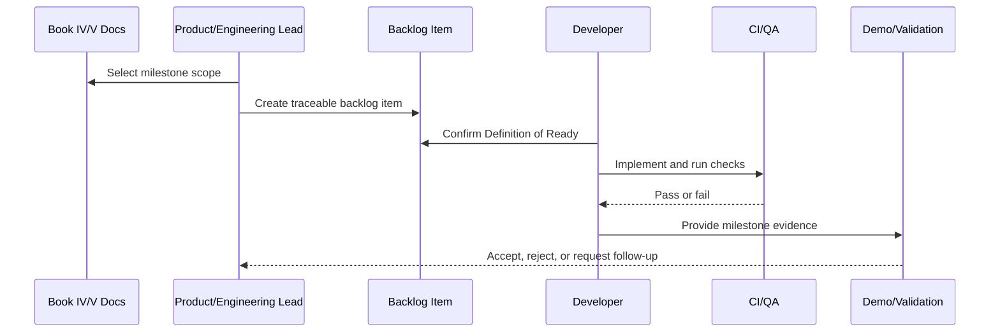

# Part 11 Summary

> *"Summarizes MVP Milestones and Backlog and defines readiness to continue into Production Readiness and Handover."*

---

# Purpose

Summarizes MVP Milestones and Backlog and defines readiness to continue into Production Readiness and Handover.

---

# Execution Problem

Production readiness requires a clear implementation backlog and milestone completion evidence.

---

# Milestone Decision

## Decision

CLARA should proceed to Production Readiness and Handover after milestones, backlog structure, gates, planning rhythm, and MVP demo validation are defined.

## Status

Accepted.

---

# Backlog Implementation Rule

Every backlog item must be designed as:

```text
Document Reference -> User/Technical Goal -> Scope -> Acceptance Criteria -> Security/Test Gates -> Demo Evidence
```

A task is not ready if it cannot be tested, reviewed, and connected to a documented CLARA domain.

---

# Recommended Backlog Flow



---

# Secure-by-Design Checklist

- [ ] Related Book IV domain is referenced.
- [ ] Related Book V execution plan is referenced.
- [ ] Authentication/authorization impact is considered.
- [ ] Organization/workspace scope is considered.
- [ ] Input validation is considered.
- [ ] Output safety is considered.
- [ ] Audit/security event need is considered.
- [ ] Test expectations are defined.
- [ ] Rollback/disable strategy is considered for risky work.
- [ ] Demo evidence is defined.

---

# Acceptance Criteria

- [ ] Milestone scope is clear.
- [ ] MVP vs post-MVP boundary is clear.
- [ ] Dependencies are identified.
- [ ] Backlog items can be created from this chapter.
- [ ] Security and QA gates are included.
- [ ] Demo/validation evidence is clear.
- [ ] AI coding assistants can follow this safely.

---

# Anti-patterns

Avoid:

- Backlog items like “build CRM” or “add AI”.
- Building modules out of dependency order.
- Marking a milestone complete without tests.
- Treating AI-generated code as reviewed.
- Skipping docs updates.
- Adding features outside MVP without explicit decision.
- Ignoring security and quality gates.
- Leaving acceptance criteria vague.
- Completing isolated screens without end-to-end workflow.

---

# Related Documents

- ../PART-01-Execution-Strategy/README.md
- ../PART-02-Repository-and-Development-Workflow/README.md
- ../PART-03-Backend-Implementation-Plan/README.md
- ../PART-04-Frontend-Implementation-Plan/README.md
- ../PART-08-Security-Implementation-Plan/README.md
- ../PART-09-Testing-and-QA-Execution/README.md
- ../PART-10-DevOps-and-Release-Execution/README.md
- ../../BOOK-04-Product-Domain-Specification/BOOK-04-Master-Index/BOOK-04-MVP-SCOPE-MAP.md

---

# Navigation

**Previous:** `204-MVP-Demo-and-Validation-Plan.md`

**Next:** `../PART-12-Production-Readiness-and-Handover/README.md`

---

# Part 11 Completion

Part 11 establishes:

- MVP milestone strategy.
- Phase 0 repo/docs hygiene.
- Phase 1 foundation/auth/org/workspace.
- Phase 2 Customer CRM.
- Phase 3 Conversations and Inbox.
- Phase 4 Knowledge Base.
- Phase 5 AI Reply Drafting.
- Phase 6 Ticketing.
- Phase 7 Integrations and Channels.
- Phase 8 Admin/Audit/Analytics/Settings.
- Phase 9 Workflow Automation baseline.
- Backlog taxonomy and labels.
- Task template and Definition of Ready.
- Estimation/prioritization model.
- Sprint and execution planning.
- Milestone acceptance gates.
- Security and quality gates.
- MVP demo and validation plan.

---

# Ready for Part 12

The next part should be:

```text
BOOK V — PART 12: Production Readiness and Handover
```

It should define:

- Production readiness checklist.
- Operational handover.
- Support readiness.
- Security sign-off.
- Data readiness.
- AI readiness.
- Integration readiness.
- Release readiness.
- Runbook handover.
- Known limitations.
- Post-MVP roadmap.
- Book V closure.
