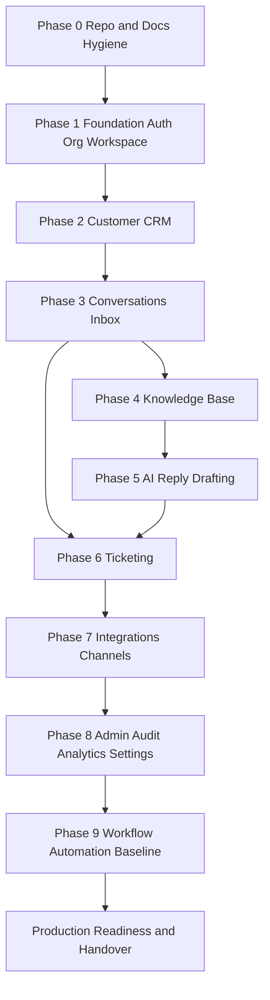

# PART-11 — MVP Milestones and Backlog

> *"A serious MVP is not a random list of features. It is a controlled path to validated production value."*

---

# Purpose

Part 11 defines CLARA MVP milestone structure and backlog execution plan.

It covers:

- MVP milestone strategy.
- Phase 0 repo and docs hygiene.
- Phase 1 foundation, auth, organization, and workspace.
- Phase 2 Customer CRM.
- Phase 3 Conversations and Inbox.
- Phase 4 Knowledge Base.
- Phase 5 AI Reply Drafting.
- Phase 6 Ticketing and Case Management.
- Phase 7 Integrations and Channels.
- Phase 8 Admin, Audit, Analytics, and Settings.
- Phase 9 Workflow Automation baseline.
- Backlog taxonomy and labels.
- Task template and Definition of Ready.
- Estimation and prioritization model.
- Sprint and execution planning.
- Milestone acceptance gates.
- Security and quality gates per milestone.
- MVP demo and validation plan.

---

# Chapter Map

| Chapter | Title |
|---:|---|
| 186 | MVP Milestones and Backlog Overview |
| 187 | MVP Milestone Strategy |
| 188 | Phase 0 Repo and Docs Hygiene |
| 189 | Phase 1 Foundation Auth Organization Workspace |
| 190 | Phase 2 Customer CRM |
| 191 | Phase 3 Conversations and Inbox |
| 192 | Phase 4 Knowledge Base |
| 193 | Phase 5 AI Reply Drafting |
| 194 | Phase 6 Ticketing and Case Management |
| 195 | Phase 7 Integrations and Channels |
| 196 | Phase 8 Admin Audit Analytics Settings |
| 197 | Phase 9 Workflow Automation Baseline |
| 198 | Backlog Taxonomy and Labels |
| 199 | Task Template and Definition of Ready |
| 200 | Estimation and Prioritization Model |
| 201 | Sprint and Execution Planning |
| 202 | Milestone Acceptance Gates |
| 203 | Security and Quality Gates per Milestone |
| 204 | MVP Demo and Validation Plan |
| 205 | Part 11 Summary |

---

# MVP Execution Map



---

# MVP Non-Negotiables

CLARA MVP milestones must enforce:

```text
No coding without related docs
No domain feature before auth/scope foundation
No AI before context and permission boundaries
No integration without validation and idempotency
No admin/export/security control without audit
No milestone completion without tests
No release candidate without smoke tests
No backlog item without acceptance criteria
No production-facing feature without rollback/disable path
```

---

# MVP Vertical Slice

The MVP should prove this flow:

```text
Admin creates organization/workspace
Admin invites user
User signs in
User creates customer
Customer sends message through one reliable channel
Agent opens conversation
Agent sees customer context
Agent generates AI reply draft
Agent edits and sends reply manually
Agent creates ticket
Knowledge helps answer
Audit records sensitive actions
Dashboard shows operational status
```

---

# Navigation

**Previous:** `../PART-10-DevOps-and-Release-Execution/185-Part-10-Summary.md`

**Next:** `186-MVP-Milestones-and-Backlog-Overview.md`
