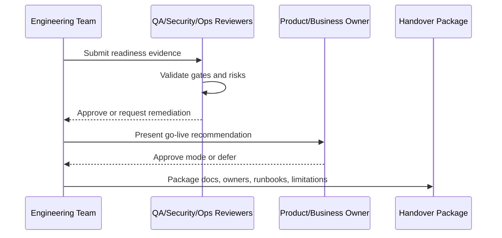

# Production Readiness and Handover Overview

> *"Defines the final production readiness and handover plan for CLARA MVP."*

---

# Purpose

Defines the final production readiness and handover plan for CLARA MVP.

---

# Readiness Problem

A system can be feature-complete but not production-ready if it lacks operational ownership, security sign-off, recovery plans, support readiness, and known limitation documentation.

---

# Handover Decision

## Decision

CLARA should only be considered ready for production handover when product, engineering, security, data, AI, integrations, testing, DevOps, support, and documentation gates are satisfied.

## Status

Accepted.

---

# Readiness Implementation Rule

Every readiness item must be supported by evidence:

```text
Checklist Item -> Evidence -> Owner -> Status -> Risk / Limitation -> Decision
```

Do not mark readiness as complete without proof.

Do not hide known limitations.

Do not hand over production operations without owners, access, runbooks, and recovery procedures.

---

# Recommended Signoff Flow



---

# Secure-by-Design Checklist

- [ ] Authentication readiness is confirmed.
- [ ] Authorization readiness is confirmed.
- [ ] Tenant/workspace isolation readiness is confirmed.
- [ ] Data backup/restore readiness is confirmed.
- [ ] AI safety/readiness is confirmed where AI is enabled.
- [ ] Integration safety/readiness is confirmed where integrations are enabled.
- [ ] Audit readiness is confirmed.
- [ ] Logging/monitoring readiness is confirmed.
- [ ] Secrets/access ownership is confirmed.
- [ ] Known risks are documented.
- [ ] Rollback/disable path exists.
- [ ] Owners are assigned.

---

# Acceptance Criteria

- [ ] Readiness criteria are clear.
- [ ] Evidence requirements are clear.
- [ ] Handover ownership is clear.
- [ ] Security and operational risks are explicit.
- [ ] Known limitations are documented.
- [ ] Go-live decision can be made from this chapter.
- [ ] AI coding assistants can follow this safely.

---

# Anti-patterns

Avoid:

- Calling MVP production-ready because demo works.
- Skipping security signoff under deadline pressure.
- Not testing restore from backup.
- Not assigning operational owners.
- Hiding known limitations.
- Shipping AI without review/fallback.
- Shipping integrations without idempotency and health checks.
- Shipping without audit for sensitive actions.
- Shipping without runbooks.
- Treating handover as a folder dump.

---

# Related Documents

- ../PART-08-Security-Implementation-Plan/README.md
- ../PART-09-Testing-and-QA-Execution/README.md
- ../PART-10-DevOps-and-Release-Execution/README.md
- ../PART-11-MVP-Milestones-and-Backlog/README.md
- ../../BOOK-04-Product-Domain-Specification/BOOK-04-Master-Index/BOOK-04-MVP-SCOPE-MAP.md

---

# Navigation

**Previous:** `../PART-11-MVP-Milestones-and-Backlog/205-Part-11-Summary.md`

**Next:** `207-Production-Readiness-Checklist.md`

---

# Readiness Goal

The goal of this part is to answer:

```text
Can CLARA be safely used by real users?
Can CLARA be operated by the team?
Can CLARA be recovered when something fails?
Can CLARA be supported when users have problems?
Can CLARA be improved without losing control?
```

---

# Readiness Evidence Categories

Use:

```text
demo evidence
test results
security review notes
migration validation
smoke test results
runbook links
monitoring dashboard links
backup/restore evidence
known limitation list
owner list
```
