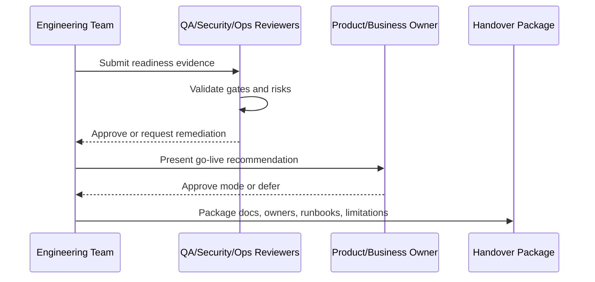

# Production Readiness Checklist

> *"Defines the final checklist for confirming CLARA can operate safely in a production-like environment."*

---

# Purpose

Defines the final checklist for confirming CLARA can operate safely in a production-like environment.

---

# Readiness Problem

Readiness based on confidence alone is fragile and usually misses operational risks.

---

# Handover Decision

## Decision

CLARA production readiness should be evaluated through explicit checklists covering functionality, security, data, reliability, observability, recovery, and support.

## Status

Accepted.

---

# Readiness Implementation Rule

Every readiness item must be supported by evidence:

```text
Checklist Item -> Evidence -> Owner -> Status -> Risk / Limitation -> Decision
```

Do not mark readiness as complete without proof.

Do not hide known limitations.

Do not hand over production operations without owners, access, runbooks, and recovery procedures.

---

# Recommended Signoff Flow



---

# Secure-by-Design Checklist

- [ ] Authentication readiness is confirmed.
- [ ] Authorization readiness is confirmed.
- [ ] Tenant/workspace isolation readiness is confirmed.
- [ ] Data backup/restore readiness is confirmed.
- [ ] AI safety/readiness is confirmed where AI is enabled.
- [ ] Integration safety/readiness is confirmed where integrations are enabled.
- [ ] Audit readiness is confirmed.
- [ ] Logging/monitoring readiness is confirmed.
- [ ] Secrets/access ownership is confirmed.
- [ ] Known risks are documented.
- [ ] Rollback/disable path exists.
- [ ] Owners are assigned.

---

# Acceptance Criteria

- [ ] Readiness criteria are clear.
- [ ] Evidence requirements are clear.
- [ ] Handover ownership is clear.
- [ ] Security and operational risks are explicit.
- [ ] Known limitations are documented.
- [ ] Go-live decision can be made from this chapter.
- [ ] AI coding assistants can follow this safely.

---

# Anti-patterns

Avoid:

- Calling MVP production-ready because demo works.
- Skipping security signoff under deadline pressure.
- Not testing restore from backup.
- Not assigning operational owners.
- Hiding known limitations.
- Shipping AI without review/fallback.
- Shipping integrations without idempotency and health checks.
- Shipping without audit for sensitive actions.
- Shipping without runbooks.
- Treating handover as a folder dump.

---

# Related Documents

- ../PART-08-Security-Implementation-Plan/README.md
- ../PART-09-Testing-and-QA-Execution/README.md
- ../PART-10-DevOps-and-Release-Execution/README.md
- ../PART-11-MVP-Milestones-and-Backlog/README.md
- ../../BOOK-04-Product-Domain-Specification/BOOK-04-Master-Index/BOOK-04-MVP-SCOPE-MAP.md

---

# Navigation

**Previous:** `206-Production-Readiness-and-Handover-Overview.md`

**Next:** `208-Product-Readiness-Signoff.md`

---

# Production Readiness Checklist

- [ ] MVP vertical slice works end-to-end.
- [ ] Auth/session baseline works.
- [ ] RBAC backend checks exist.
- [ ] Tenant/workspace isolation tests pass.
- [ ] Core APIs return safe errors.
- [ ] Frontend handles loading/empty/error states.
- [ ] Database migrations are tested.
- [ ] Backups are configured.
- [ ] Restore has been tested.
- [ ] AI has human review and fallback.
- [ ] Integrations have validation/idempotency.
- [ ] Critical audit events exist.
- [ ] Logs are redacted.
- [ ] Monitoring and alerts exist.
- [ ] Smoke tests exist.
- [ ] Rollback/disable strategy exists.
- [ ] Runbooks exist.
- [ ] Support workflow is known.
- [ ] Known limitations are documented.
