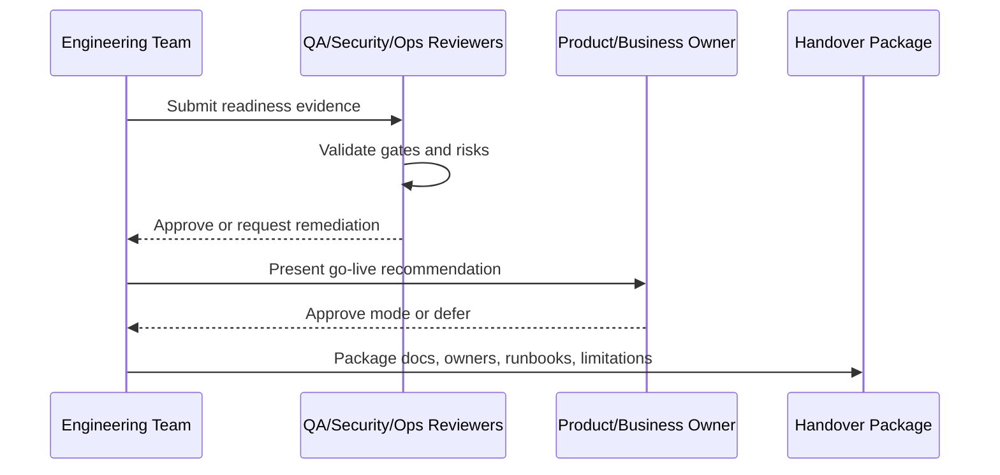

# AI Readiness Signoff

> *"Defines AI readiness criteria for CLARA AI features."*

---

# Purpose

Defines AI readiness criteria for CLARA AI features.

---

# Readiness Problem

AI can produce unsafe, inaccurate, or privacy-risky output if released without clear readiness checks.

---

# Handover Decision

## Decision

CLARA AI readiness should confirm AI Gateway, provider abstraction, scoped context, RAG eligibility, prompt versioning, human review, safety, audit, evaluation, cost limits, and fallback behavior.

## Status

Accepted.

---

# Readiness Implementation Rule

Every readiness item must be supported by evidence:

```text
Checklist Item -> Evidence -> Owner -> Status -> Risk / Limitation -> Decision
```

Do not mark readiness as complete without proof.

Do not hide known limitations.

Do not hand over production operations without owners, access, runbooks, and recovery procedures.

---

# Recommended Signoff Flow



---

# Secure-by-Design Checklist

- [ ] Authentication readiness is confirmed.
- [ ] Authorization readiness is confirmed.
- [ ] Tenant/workspace isolation readiness is confirmed.
- [ ] Data backup/restore readiness is confirmed.
- [ ] AI safety/readiness is confirmed where AI is enabled.
- [ ] Integration safety/readiness is confirmed where integrations are enabled.
- [ ] Audit readiness is confirmed.
- [ ] Logging/monitoring readiness is confirmed.
- [ ] Secrets/access ownership is confirmed.
- [ ] Known risks are documented.
- [ ] Rollback/disable path exists.
- [ ] Owners are assigned.

---

# Acceptance Criteria

- [ ] Readiness criteria are clear.
- [ ] Evidence requirements are clear.
- [ ] Handover ownership is clear.
- [ ] Security and operational risks are explicit.
- [ ] Known limitations are documented.
- [ ] Go-live decision can be made from this chapter.
- [ ] AI coding assistants can follow this safely.

---

# Anti-patterns

Avoid:

- Calling MVP production-ready because demo works.
- Skipping security signoff under deadline pressure.
- Not testing restore from backup.
- Not assigning operational owners.
- Hiding known limitations.
- Shipping AI without review/fallback.
- Shipping integrations without idempotency and health checks.
- Shipping without audit for sensitive actions.
- Shipping without runbooks.
- Treating handover as a folder dump.

---

# Related Documents

- ../PART-08-Security-Implementation-Plan/README.md
- ../PART-09-Testing-and-QA-Execution/README.md
- ../PART-10-DevOps-and-Release-Execution/README.md
- ../PART-11-MVP-Milestones-and-Backlog/README.md
- ../../BOOK-04-Product-Domain-Specification/BOOK-04-Master-Index/BOOK-04-MVP-SCOPE-MAP.md

---

# Navigation

**Previous:** `211-Data-Readiness-Signoff.md`

**Next:** `213-Integration-Readiness-Signoff.md`

---

# AI Readiness Criteria

AI readiness should confirm:

```text
AI Gateway exists
provider adapter works
prompt templates are versioned
context is permission-scoped
knowledge retrieval uses eligible sources
reply drafts require human review
AI outputs are labeled
feedback is captured where practical
AI audit metadata exists
usage limits/rate limits exist
fallback behavior exists
```

---

# AI Evidence

Evidence may include:

```text
AI evaluation scenarios
prompt template version list
context boundary test results
RAG eligibility test results
AI audit sample
AI fallback test
usage metric sample
```
