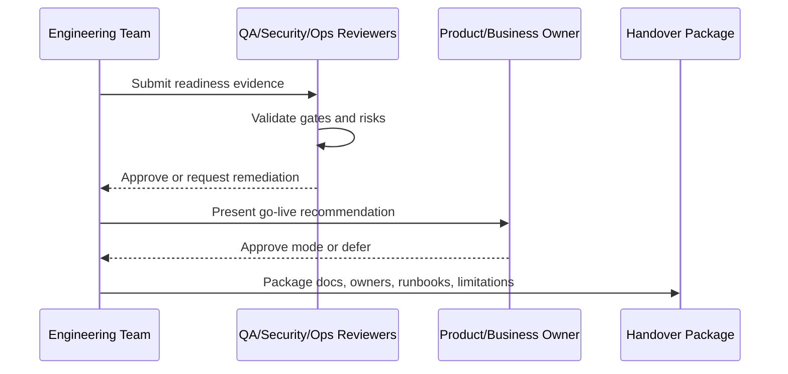

# DevOps and Operations Readiness Signoff

> *"Defines DevOps and operations readiness for deployments, monitoring, alerts, backups, rollback, incident response, and environment separation."*

---

# Purpose

Defines DevOps and operations readiness for deployments, monitoring, alerts, backups, rollback, incident response, and environment separation.

---

# Readiness Problem

A product is not production-ready if only one person knows how to deploy or recover it.

---

# Handover Decision

## Decision

CLARA operations readiness should confirm that the system can be deployed, observed, recovered, and operated by people other than the original builders.

## Status

Accepted.

---

# Readiness Implementation Rule

Every readiness item must be supported by evidence:

```text
Checklist Item -> Evidence -> Owner -> Status -> Risk / Limitation -> Decision
```

Do not mark readiness as complete without proof.

Do not hide known limitations.

Do not hand over production operations without owners, access, runbooks, and recovery procedures.

---

# Recommended Signoff Flow



---

# Secure-by-Design Checklist

- [ ] Authentication readiness is confirmed.
- [ ] Authorization readiness is confirmed.
- [ ] Tenant/workspace isolation readiness is confirmed.
- [ ] Data backup/restore readiness is confirmed.
- [ ] AI safety/readiness is confirmed where AI is enabled.
- [ ] Integration safety/readiness is confirmed where integrations are enabled.
- [ ] Audit readiness is confirmed.
- [ ] Logging/monitoring readiness is confirmed.
- [ ] Secrets/access ownership is confirmed.
- [ ] Known risks are documented.
- [ ] Rollback/disable path exists.
- [ ] Owners are assigned.

---

# Acceptance Criteria

- [ ] Readiness criteria are clear.
- [ ] Evidence requirements are clear.
- [ ] Handover ownership is clear.
- [ ] Security and operational risks are explicit.
- [ ] Known limitations are documented.
- [ ] Go-live decision can be made from this chapter.
- [ ] AI coding assistants can follow this safely.

---

# Anti-patterns

Avoid:

- Calling MVP production-ready because demo works.
- Skipping security signoff under deadline pressure.
- Not testing restore from backup.
- Not assigning operational owners.
- Hiding known limitations.
- Shipping AI without review/fallback.
- Shipping integrations without idempotency and health checks.
- Shipping without audit for sensitive actions.
- Shipping without runbooks.
- Treating handover as a folder dump.

---

# Related Documents

- ../PART-08-Security-Implementation-Plan/README.md
- ../PART-09-Testing-and-QA-Execution/README.md
- ../PART-10-DevOps-and-Release-Execution/README.md
- ../PART-11-MVP-Milestones-and-Backlog/README.md
- ../../BOOK-04-Product-Domain-Specification/BOOK-04-Master-Index/BOOK-04-MVP-SCOPE-MAP.md

---

# Navigation

**Previous:** `214-Testing-and-QA-Readiness-Signoff.md`

**Next:** `216-Support-and-Customer-Operations-Readiness.md`

---

# Operations Readiness Criteria

Operations should confirm:

```text
environment separation exists
deployment process works
rollback process exists
monitoring exists
alerts have owners
logs are useful and safe
backup process exists
restore process tested
incident response process exists
runbooks exist
```

---

# Operations Evidence

Evidence may include:

```text
deployment runbook
rollback test note
monitoring dashboard link
alert policy list
backup/restore evidence
incident response runbook
smoke test result
```
