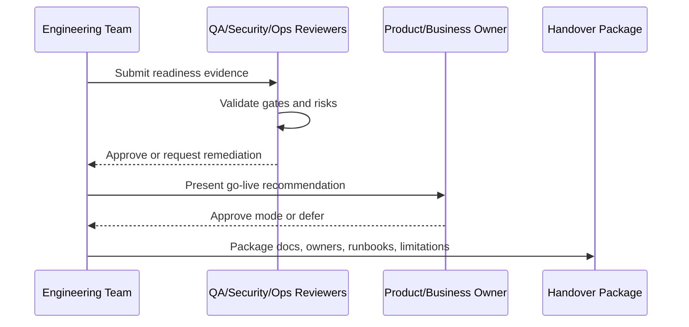

# Support and Customer Operations Readiness

> *"Defines support readiness for internal operators, support agents, admin users, troubleshooting, escalation, and customer-facing support workflows."*

---

# Purpose

Defines support readiness for internal operators, support agents, admin users, troubleshooting, escalation, and customer-facing support workflows.

---

# Readiness Problem

A production system without support readiness creates user frustration and operational confusion.

---

# Handover Decision

## Decision

CLARA support readiness should ensure users and operators know how to use the MVP, report issues, escalate incidents, and understand limitations.

## Status

Accepted.

---

# Readiness Implementation Rule

Every readiness item must be supported by evidence:

```text
Checklist Item -> Evidence -> Owner -> Status -> Risk / Limitation -> Decision
```

Do not mark readiness as complete without proof.

Do not hide known limitations.

Do not hand over production operations without owners, access, runbooks, and recovery procedures.

---

# Recommended Signoff Flow



---

# Secure-by-Design Checklist

- [ ] Authentication readiness is confirmed.
- [ ] Authorization readiness is confirmed.
- [ ] Tenant/workspace isolation readiness is confirmed.
- [ ] Data backup/restore readiness is confirmed.
- [ ] AI safety/readiness is confirmed where AI is enabled.
- [ ] Integration safety/readiness is confirmed where integrations are enabled.
- [ ] Audit readiness is confirmed.
- [ ] Logging/monitoring readiness is confirmed.
- [ ] Secrets/access ownership is confirmed.
- [ ] Known risks are documented.
- [ ] Rollback/disable path exists.
- [ ] Owners are assigned.

---

# Acceptance Criteria

- [ ] Readiness criteria are clear.
- [ ] Evidence requirements are clear.
- [ ] Handover ownership is clear.
- [ ] Security and operational risks are explicit.
- [ ] Known limitations are documented.
- [ ] Go-live decision can be made from this chapter.
- [ ] AI coding assistants can follow this safely.

---

# Anti-patterns

Avoid:

- Calling MVP production-ready because demo works.
- Skipping security signoff under deadline pressure.
- Not testing restore from backup.
- Not assigning operational owners.
- Hiding known limitations.
- Shipping AI without review/fallback.
- Shipping integrations without idempotency and health checks.
- Shipping without audit for sensitive actions.
- Shipping without runbooks.
- Treating handover as a folder dump.

---

# Related Documents

- ../PART-08-Security-Implementation-Plan/README.md
- ../PART-09-Testing-and-QA-Execution/README.md
- ../PART-10-DevOps-and-Release-Execution/README.md
- ../PART-11-MVP-Milestones-and-Backlog/README.md
- ../../BOOK-04-Product-Domain-Specification/BOOK-04-Master-Index/BOOK-04-MVP-SCOPE-MAP.md

---

# Navigation

**Previous:** `215-DevOps-and-Operations-Readiness-Signoff.md`

**Next:** `217-Documentation-Handover.md`

---

# Support Readiness Criteria

Support/customer operations should know:

```text
who can use CLARA
what MVP can do
what MVP cannot do
how to report bugs
how to escalate incidents
how to reset/recover common issues
how to explain AI behavior
how to handle integration/channel failures
```

---

# Support Materials

Prepare:

```text
internal FAQ
known limitations
basic user guide
admin guide
AI usage guidance
integration troubleshooting guide
incident escalation path
```
