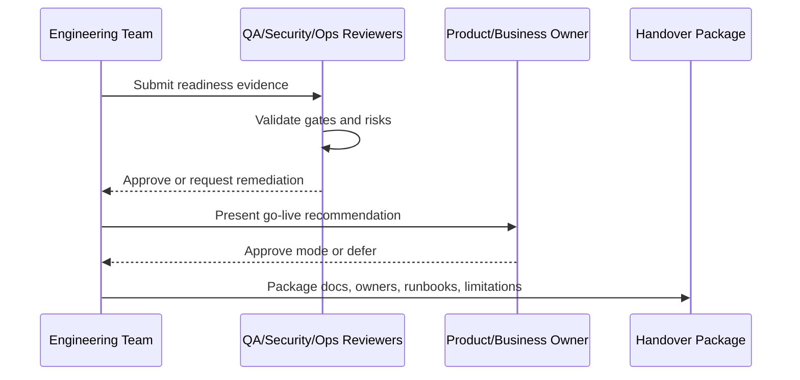

# Handover Package Index

> *"Defines the recommended final handover package structure and index for CLARA MVP."*

---

# Purpose

Defines the recommended final handover package structure and index for CLARA MVP.

---

# Readiness Problem

A scattered handover makes it difficult for future engineers, operators, and stakeholders to continue safely.

---

# Handover Decision

## Decision

CLARA handover package should organize documents, checklists, runbooks, release artifacts, links, owners, and sign-off evidence in one discoverable index.

## Status

Accepted.

---

# Readiness Implementation Rule

Every readiness item must be supported by evidence:

```text
Checklist Item -> Evidence -> Owner -> Status -> Risk / Limitation -> Decision
```

Do not mark readiness as complete without proof.

Do not hide known limitations.

Do not hand over production operations without owners, access, runbooks, and recovery procedures.

---

# Recommended Signoff Flow



---

# Secure-by-Design Checklist

- [ ] Authentication readiness is confirmed.
- [ ] Authorization readiness is confirmed.
- [ ] Tenant/workspace isolation readiness is confirmed.
- [ ] Data backup/restore readiness is confirmed.
- [ ] AI safety/readiness is confirmed where AI is enabled.
- [ ] Integration safety/readiness is confirmed where integrations are enabled.
- [ ] Audit readiness is confirmed.
- [ ] Logging/monitoring readiness is confirmed.
- [ ] Secrets/access ownership is confirmed.
- [ ] Known risks are documented.
- [ ] Rollback/disable path exists.
- [ ] Owners are assigned.

---

# Acceptance Criteria

- [ ] Readiness criteria are clear.
- [ ] Evidence requirements are clear.
- [ ] Handover ownership is clear.
- [ ] Security and operational risks are explicit.
- [ ] Known limitations are documented.
- [ ] Go-live decision can be made from this chapter.
- [ ] AI coding assistants can follow this safely.

---

# Anti-patterns

Avoid:

- Calling MVP production-ready because demo works.
- Skipping security signoff under deadline pressure.
- Not testing restore from backup.
- Not assigning operational owners.
- Hiding known limitations.
- Shipping AI without review/fallback.
- Shipping integrations without idempotency and health checks.
- Shipping without audit for sensitive actions.
- Shipping without runbooks.
- Treating handover as a folder dump.

---

# Related Documents

- ../PART-08-Security-Implementation-Plan/README.md
- ../PART-09-Testing-and-QA-Execution/README.md
- ../PART-10-DevOps-and-Release-Execution/README.md
- ../PART-11-MVP-Milestones-and-Backlog/README.md
- ../../BOOK-04-Product-Domain-Specification/BOOK-04-Master-Index/BOOK-04-MVP-SCOPE-MAP.md

---

# Navigation

**Previous:** `222-Go-Live-Decision-Framework.md`

**Next:** `224-Book-V-Closure.md`

---

# Handover Package Structure

Recommended:

```text
handover/
├── 00-Handover-Index.md
├── 01-Owners-and-Access.md
├── 02-Production-Readiness-Checklist.md
├── 03-Signoff-Evidence.md
├── 04-Runbooks/
├── 05-Known-Limitations.md
├── 06-Release-Notes.md
├── 07-Post-MVP-Roadmap.md
└── 08-Incident-and-Support-Contacts.md
```

---

# Handover Index Must Answer

```text
Where are the docs?
Who owns what?
How do we deploy?
How do we rollback?
How do we recover data?
How do we handle incidents?
What risks are accepted?
What comes next?
```
