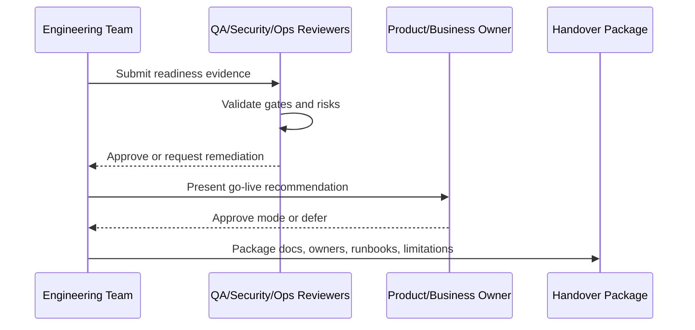

# Part 12 Summary

> *"Summarizes Production Readiness and Handover and closes Book V."*

---

# Purpose

Summarizes Production Readiness and Handover and closes Book V.

---

# Readiness Problem

Without a final closure, the team may not know whether documentation is complete enough to start coding.

---

# Handover Decision

## Decision

CLARA Book V is complete when all engineering execution parts exist and the team can move from documentation into controlled implementation.

## Status

Accepted.

---

# Readiness Implementation Rule

Every readiness item must be supported by evidence:

```text
Checklist Item -> Evidence -> Owner -> Status -> Risk / Limitation -> Decision
```

Do not mark readiness as complete without proof.

Do not hide known limitations.

Do not hand over production operations without owners, access, runbooks, and recovery procedures.

---

# Recommended Signoff Flow



---

# Secure-by-Design Checklist

- [ ] Authentication readiness is confirmed.
- [ ] Authorization readiness is confirmed.
- [ ] Tenant/workspace isolation readiness is confirmed.
- [ ] Data backup/restore readiness is confirmed.
- [ ] AI safety/readiness is confirmed where AI is enabled.
- [ ] Integration safety/readiness is confirmed where integrations are enabled.
- [ ] Audit readiness is confirmed.
- [ ] Logging/monitoring readiness is confirmed.
- [ ] Secrets/access ownership is confirmed.
- [ ] Known risks are documented.
- [ ] Rollback/disable path exists.
- [ ] Owners are assigned.

---

# Acceptance Criteria

- [ ] Readiness criteria are clear.
- [ ] Evidence requirements are clear.
- [ ] Handover ownership is clear.
- [ ] Security and operational risks are explicit.
- [ ] Known limitations are documented.
- [ ] Go-live decision can be made from this chapter.
- [ ] AI coding assistants can follow this safely.

---

# Anti-patterns

Avoid:

- Calling MVP production-ready because demo works.
- Skipping security signoff under deadline pressure.
- Not testing restore from backup.
- Not assigning operational owners.
- Hiding known limitations.
- Shipping AI without review/fallback.
- Shipping integrations without idempotency and health checks.
- Shipping without audit for sensitive actions.
- Shipping without runbooks.
- Treating handover as a folder dump.

---

# Related Documents

- ../PART-08-Security-Implementation-Plan/README.md
- ../PART-09-Testing-and-QA-Execution/README.md
- ../PART-10-DevOps-and-Release-Execution/README.md
- ../PART-11-MVP-Milestones-and-Backlog/README.md
- ../../BOOK-04-Product-Domain-Specification/BOOK-04-Master-Index/BOOK-04-MVP-SCOPE-MAP.md

---

# Navigation

**Previous:** `224-Book-V-Closure.md`

**Next:** `../BOOK-05-Master-Index/README.md`

---

# Part 12 Completion

Part 12 establishes:

- Production readiness overview.
- Final readiness checklist.
- Product signoff.
- Engineering signoff.
- Security signoff.
- Data signoff.
- AI signoff.
- Integration signoff.
- QA signoff.
- DevOps/operations signoff.
- Support readiness.
- Documentation handover.
- Runbook handover.
- Access and ownership handover.
- Known limitations and risk acceptance.
- Post-MVP roadmap.
- Go-live decision framework.
- Handover package index.
- Book V closure.

---

# Book V Complete

Book V now defines how CLARA should move from specification into controlled implementation.

The next recommended artifact is:

```text
BOOK-05 Master Index
```

It should map all Book V parts, chapters, execution dependencies, milestone gates, and next coding steps.
