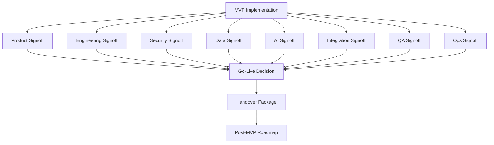

# PART-12 — Production Readiness and Handover

> *"A product is not ready because it works once. A product is ready when it can be operated, recovered, supported, and safely improved."*

---

# Purpose

Part 12 defines CLARA production readiness and handover plan.

It covers:

- Production readiness checklist.
- Product readiness signoff.
- Engineering readiness signoff.
- Security readiness signoff.
- Data readiness signoff.
- AI readiness signoff.
- Integration readiness signoff.
- Testing and QA readiness signoff.
- DevOps and operations readiness signoff.
- Support and customer operations readiness.
- Documentation handover.
- Runbook handover.
- Access and ownership handover.
- Known limitations and risk acceptance.
- Post-MVP roadmap and next increments.
- Go-live decision framework.
- Handover package index.
- Book V closure.

---

# Chapter Map

| Chapter | Title |
|---:|---|
| 206 | Production Readiness and Handover Overview |
| 207 | Production Readiness Checklist |
| 208 | Product Readiness Signoff |
| 209 | Engineering Readiness Signoff |
| 210 | Security Readiness Signoff |
| 211 | Data Readiness Signoff |
| 212 | AI Readiness Signoff |
| 213 | Integration Readiness Signoff |
| 214 | Testing and QA Readiness Signoff |
| 215 | DevOps and Operations Readiness Signoff |
| 216 | Support and Customer Operations Readiness |
| 217 | Documentation Handover |
| 218 | Runbook Handover |
| 219 | Access and Ownership Handover |
| 220 | Known Limitations and Risk Acceptance |
| 221 | Post MVP Roadmap and Next Increments |
| 222 | Go Live Decision Framework |
| 223 | Handover Package Index |
| 224 | Book V Closure |
| 225 | Part 12 Summary |

---

# Readiness Execution Map



---

# Production Readiness Non-Negotiables

CLARA cannot be considered production-ready unless:

```text
Core MVP vertical slice works
Authentication and authorization are enforced
Tenant/workspace isolation tests pass
Database migrations are tested
Backups and restore procedure exist
Critical flows are tested
AI outputs are human-reviewed
Integration payloads are validated and idempotent
Audit events exist for sensitive actions
Logs are safe and useful
Monitoring and smoke tests exist
Rollback/disable strategy exists
Runbooks exist
Known limitations are documented
Owners are assigned
```

---

# Recommended Go-Live Modes

CLARA can choose:

```text
Not ready
Staging only
Internal alpha
Private beta
Limited production
General production
```

The correct choice depends on evidence from readiness gates.

---

# Navigation

**Previous:** `../PART-11-MVP-Milestones-and-Backlog/205-Part-11-Summary.md`

**Next:** `206-Production-Readiness-and-Handover-Overview.md`
