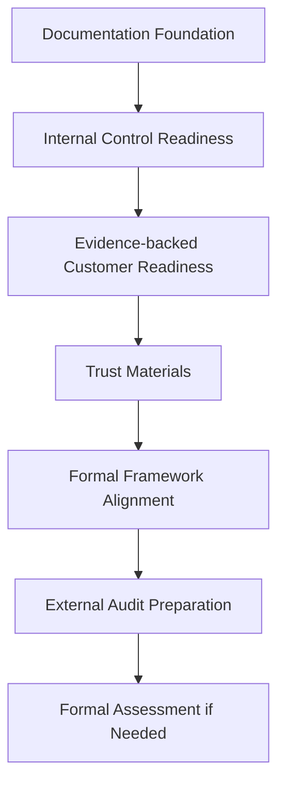

# BOOK-06-COMPLIANCE-ROADMAP-MAP

> *"Compliance readiness matures from internal discipline into external proof."*

---

# Roadmap Stages

```text
Stage 0: Documentation foundation
Stage 1: Internal control readiness
Stage 2: Evidence-backed customer review readiness
Stage 3: Trust material readiness
Stage 4: Formal framework alignment
Stage 5: External audit/certification preparation
Stage 6: Formal assessment if business need justifies
```

---

# Roadmap Flow



---

# Compliance Claim Boundary

CLARA must clearly separate:

```text
documented
implemented
evidenced
reviewed
aligned
certified
```

Do not claim a higher maturity state than the team can prove.

---

# Customer Trust Assets

```text
security overview
privacy overview
AI governance summary
integration security summary
incident response summary
subprocessor/provider list
responsible disclosure process
security contact path
security questionnaire answer pack
```

---

# Compliance Operating Milestones

| Milestone | Outcome |
|---|---|
| M1 | Risk register and control library exist |
| M2 | Evidence repository exists |
| M3 | High-risk controls mapped to evidence |
| M4 | Access/data/AI/integration reviews operating |
| M5 | Customer questionnaire pack ready |
| M6 | Trust material v1 ready |
| M7 | Critical/high gaps remediated or accepted |
| M8 | Mock audit/advisory review complete |
| M9 | External audit readiness decision |
| M10 | Formal assessment if business need justifies |
