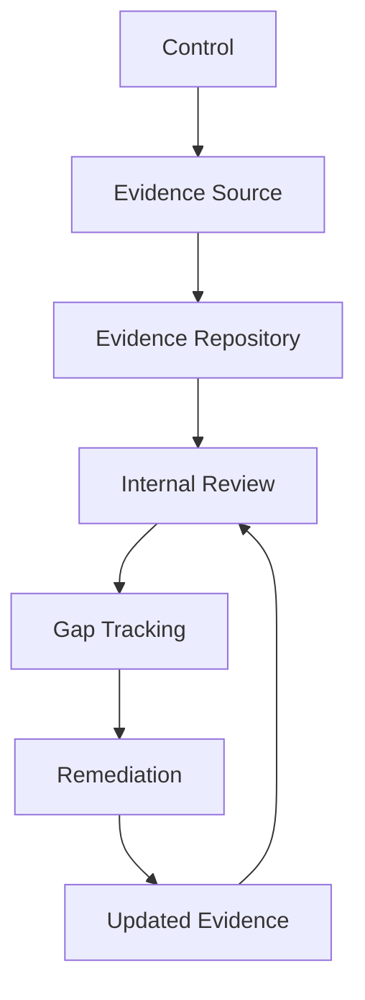

# BOOK-06-EVIDENCE-MAP

> *"Evidence is the bridge between what CLARA says and what CLARA can prove."*

---

# Evidence Categories

| Evidence Category | Examples |
|---|---|
| Access Evidence | access reviews, RBAC tests, audit logs |
| Data Protection Evidence | data inventory, export logs, retention jobs |
| AI Evidence | prompt versions, evals, AI audit metadata |
| Integration Evidence | provider reviews, webhook logs, health records |
| SDLC Evidence | PR reviews, CI results, security tests |
| Incident Evidence | timelines, logs, postmortems, remediation tasks |
| Risk Evidence | risk register, acceptance records, control mapping |
| Compliance Evidence | questionnaire answers, trust materials, gap tracking |

---

# Evidence Repository Structure

```text
evidence/
├── access-reviews/
├── control-mapping/
├── ci-and-release/
├── security-tests/
├── ai-evaluations/
├── integration-reviews/
├── incidents/
├── risk-acceptance/
├── vendor-reviews/
├── backup-restore/
└── customer-security-reviews/
```

---

# Evidence Quality Rules

Good evidence is:

```text
timestamped
owner-linked
control-linked
specific
repeatable
reviewable
access-controlled
retained long enough
not overly sensitive
```

---

# Evidence Flow



---

# Evidence Boundaries

| Boundary | Shareability |
|---|---|
| Public | safe public security overview |
| NDA-bound | customer questionnaire/security summary |
| Restricted | architecture/security diagrams |
| Internal only | raw logs, incidents, vulnerabilities, secrets/configs |

---

# Evidence Rule

Do not make external security/compliance claims that cannot be backed by evidence.
