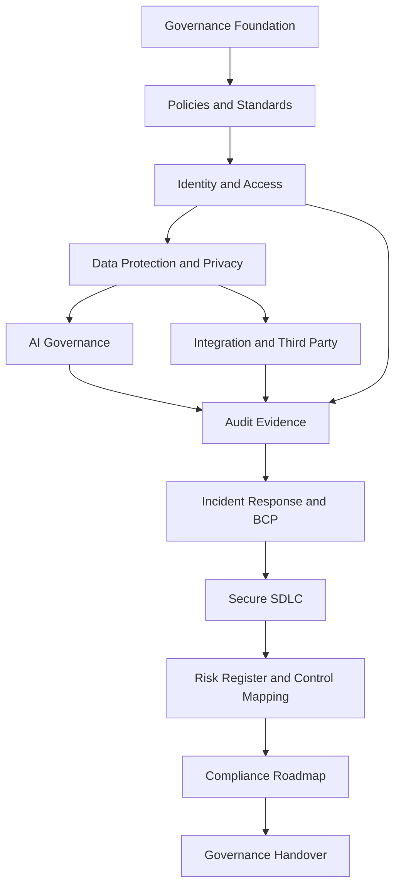

# BOOK-06-GOVERNANCE-DEPENDENCY-MAP

> *"Governance areas are not isolated. Each one depends on the others to be trustworthy."*

---

# Dependency Overview



---

# Dependency Rules

| Governance Area | Depends On | Why |
|---|---|---|
| Policies | Governance foundation | Policies require owners, authority, review cadence |
| Access governance | Policies | Access must follow policy requirements |
| Data protection | Access governance | Data controls depend on trusted access boundaries |
| AI governance | Data protection | AI context is built from governed data |
| Integration governance | Data protection and access | External systems process scoped data/credentials |
| Audit readiness | All controls | Evidence proves controls exist and operate |
| Incident response | Logs/evidence/access | Incidents require traceability and authority |
| Secure SDLC | Incidents and policies | Development must learn from incidents and enforce policy |
| Risk/control mapping | All governance domains | Risks and controls must unify across domains |
| Compliance roadmap | Risk/control/evidence | Compliance maturity depends on actual posture |
| Handover | Everything | Governance must survive team transitions |

---

# Critical Governance Chains

## Customer Data Chain

```text
Access Governance -> Data Protection -> Export Governance -> Audit Evidence -> Incident Response
```

## AI Safety Chain

```text
Data Protection -> AI Context Governance -> Human Review -> AI Audit -> AI Incident Kill Switch
```

## Integration Safety Chain

```text
Third-Party Inventory -> Credential Governance -> Webhook/API Controls -> Monitoring -> Incident Response
```

## Compliance Chain

```text
Policy -> Control -> Evidence -> Gap Tracking -> Customer Trust -> Compliance Roadmap
```
