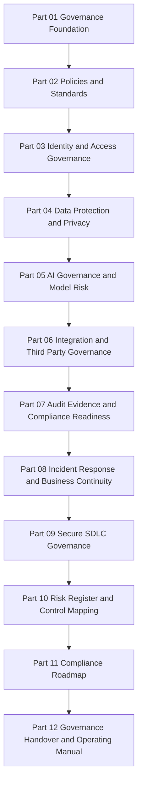

# BOOK-06-MASTER-INDEX

> *"Governance is production infrastructure for trust."*

---

# Book VI Objective

Book VI establishes CLARA's security, governance, risk, privacy, AI governance, third-party governance, audit evidence, incident response, secure SDLC, and compliance operating model.

It is designed to answer these production questions:

```text
Who owns security decisions?
Which policies apply?
Who can access what?
How is customer data protected?
How is AI governed?
How are integrations approved?
What evidence proves controls work?
How are incidents handled?
How are secure releases governed?
How are risks tracked?
How does CLARA mature toward compliance readiness?
How is governance handed over and operated?
```

---

# Book VI Canonical Flow



---

# Book VI Deliverables

Book VI produces:

```text
governance principles
security ownership model
policy framework
access governance model
data protection governance model
AI governance model
third-party governance model
audit evidence model
incident response governance
business continuity governance
secure SDLC governance
risk register structure
control library structure
compliance roadmap
governance operating manual
```

---

# How to Use This Book

Use Book VI when:

```text
planning high-risk features
designing RBAC/access controls
processing customer data
building AI features
adding integrations
handling incidents
answering security questionnaires
preparing release gates
tracking risks
reviewing controls
operating governance cadence
```

---

# Production Rule

If a CLARA production decision affects security, privacy, AI, integrations, customer data, incidents, or compliance, it should map back to Book VI.
