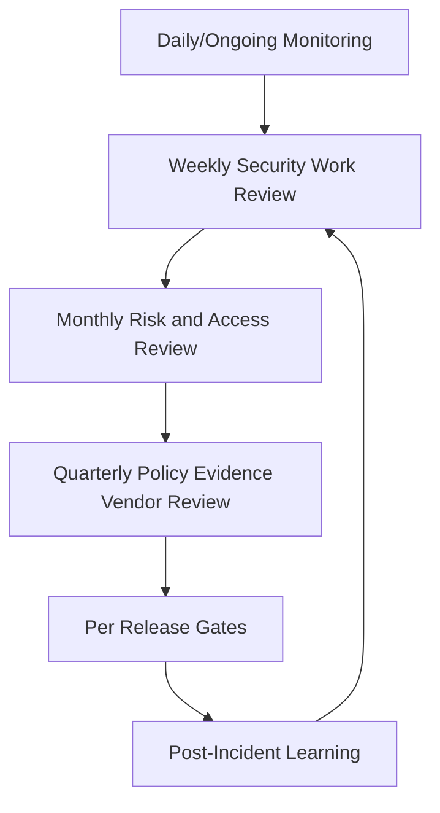

# BOOK-06-OPERATING-CADENCE-MAP

> *"If a governance review matters, put it on the calendar."*

---

# Operating Cadence

## Daily / Ongoing

```text
watch critical alerts and incidents
review urgent security findings
track high-risk access, AI, or integration issues
```

## Weekly

```text
review open security tasks
review high-risk PRs/changes
update active incidents/gaps
triage vulnerabilities and dependency findings
```

## Monthly

```text
risk register review
privileged access review
vulnerability/dependency review
AI and integration health review
open incident action review
```

## Quarterly

```text
policy review
control evidence review
vendor/third-party review
privacy/data review
compliance roadmap review
access recertification where applicable
```

## Per Release

```text
security release gate
known risk review
smoke/security test evidence
migration review
rollback/disable readiness
release evidence capture
```

## After Incident

```text
postmortem
risk/control updates
runbook updates
test additions
monitoring additions
follow-up validation
```

---

# Governance Calendar Map



---

# Review Output Standard

Every review should produce:

```text
date
participants
scope
findings
decisions
risks updated
controls updated
evidence linked
owners
due dates
next review
```
