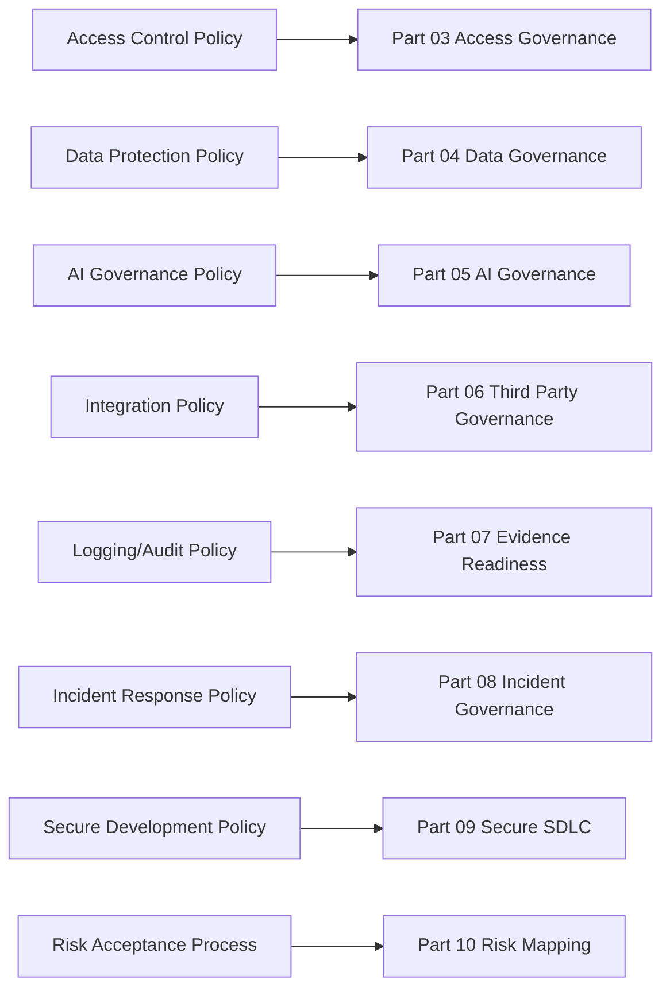

# BOOK-06-POLICY-MAP

> *"Policies define what must be true. Controls and evidence prove whether it is true."*

---

# Core Policy Set

| Policy | Primary Source | Core Enforcement Area |
|---|---|---|
| Access Control Policy | Part 02 Chapter 14 | RBAC, scope, admin access, access review |
| Data Protection and Privacy Policy | Part 02 Chapter 15 | classification, minimization, retention, exports |
| Secure Development Policy | Part 02 Chapter 16 | SDLC gates, review, tests, dependency review |
| Secrets Management Policy | Part 02 Chapter 17 | credentials, API keys, secret storage, rotation |
| Logging Audit and Evidence Policy | Part 02 Chapter 18 | logs, audit events, evidence retention |
| AI Usage and Governance Policy | Part 02 Chapter 19 | AI Gateway, prompt/context/review/eval/audit |
| Integration and Third Party Security Policy | Part 02 Chapter 20 | webhooks, providers, credentials, data sharing |
| Incident Response Policy | Part 02 Chapter 21 | declaration, severity, containment, postmortem |
| Vulnerability and Patch Management Policy | Part 02 Chapter 22 | vuln intake, triage, remediation, closure |
| Policy Exception and Risk Acceptance Process | Part 02 Chapter 23 | exceptions, approvals, expiry, compensating controls |

---

# Policy to Governance Mapping



---

# Policy Lifecycle

```text
draft
review
approve
publish
communicate
implement controls
collect evidence
review
update
retire/supersede
```

---

# Policy Anti-Pattern

```text
policy without owner
policy without control mapping
policy without evidence
policy without exception process
policy without review cadence
```
