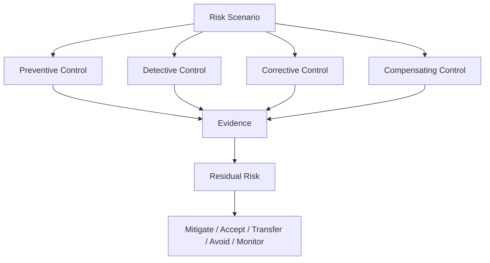

# BOOK-06-RISK-AND-CONTROL-MAP

> *"A risk register is useful only when it changes what the team does."*

---

# Risk Register Minimum Fields

```text
risk_id
title
description
category
asset/data affected
scenario
likelihood
impact
severity
owner
status
existing controls
planned controls
residual risk
treatment decision
accepted by
review date
evidence links
```

---

# Control Library Minimum Fields

```text
control_id
control_name
category
requirement
owner
implementation reference
related policy
related risks
evidence source
test coverage
review cadence
maturity level
status
```

---

# Risk Categories

```text
identity_access
tenant_isolation
data_privacy
ai_model_risk
integration_third_party
application_security
infrastructure_devops
secure_sdlc
incident_response
business_continuity
compliance_readiness
vendor_risk
operational_process
```

---

# Control Types

| Type | Purpose |
|---|---|
| Preventive | Prevent bad outcome |
| Detective | Detect bad outcome |
| Corrective | Recover/fix after issue |
| Compensating | Reduce risk when ideal control is missing |
| Directive | Guide behavior through policy/standard |

---

# Risk to Control Flow



---

# Initial High-Value Controls

```text
workspace-scoped authorization
RBAC permission enforcement
cross-workspace negative tests
audit logs for sensitive actions
AI Gateway-only model access
AI human review for customer-visible outputs
integration webhook validation
idempotency for external events
secret redaction
dependency/vulnerability review
incident severity model
backup/restore evidence
```
