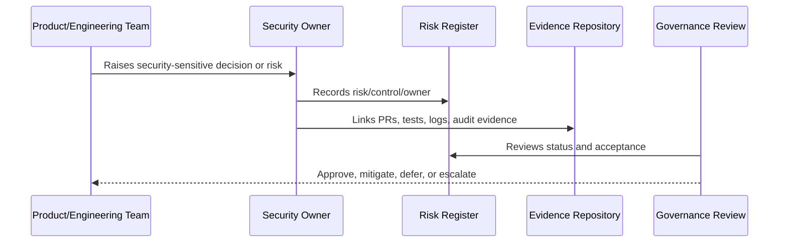

# Book VI Overview

> *"Introduces Book VI as CLARA's security, governance, risk, and compliance operating layer."*

---

# Purpose

Introduces Book VI as CLARA's security, governance, risk, and compliance operating layer.

---

# Governance Problem

Without governance, security becomes scattered technical controls without accountability, review cadence, or decision authority.

---

# Governance Decision

## Decision

Book VI should define how CLARA is governed securely after implementation planning, including ownership, risk, controls, policies, audits, compliance, and operational accountability.

## Status

Accepted.

---

# Governance Rule

Every security governance area must be managed as:

```text
Principle -> Owner -> Control -> Evidence -> Review Cadence -> Risk Decision
```

A control is not mature unless there is:

```text
clear owner
clear implementation path
clear evidence
clear review rhythm
clear exception process
```

---

# Recommended Governance Flow



---

# Secure-by-Design Checklist

- [ ] Owner is defined.
- [ ] Backup owner is defined where needed.
- [ ] Risk is documented.
- [ ] Control is mapped to implementation.
- [ ] Evidence source is defined.
- [ ] Review cadence is defined.
- [ ] Exception path is defined.
- [ ] Escalation path is defined.
- [ ] Impact on AI/integrations/data is considered where relevant.

---

# Acceptance Criteria

- [ ] Governance responsibility is clear.
- [ ] Risk/control relationship is clear.
- [ ] Evidence expectations are clear.
- [ ] Review rhythm is clear.
- [ ] Security exceptions are handled explicitly.
- [ ] AI coding assistants can follow this safely.

---

# Anti-patterns

Avoid:

- Security ownership by assumption.
- Risk acceptance without named approver.
- Policies with no implementation controls.
- Controls with no evidence.
- Reviews with no follow-up owner.
- Audit readiness only after an audit request.
- Treating AI and integrations as normal low-risk features.
- Hiding known risks inside informal chat.

---

# Related Documents

- ../../BOOK-05-Engineering-Execution-Plan/PART-08-Security-Implementation-Plan/README.md
- ../../BOOK-05-Engineering-Execution-Plan/PART-10-DevOps-and-Release-Execution/README.md
- ../../BOOK-05-Engineering-Execution-Plan/PART-12-Production-Readiness-and-Handover/README.md
- ../../BOOK-04-Product-Domain-Specification/BOOK-04-Master-Index/BOOK-04-AI-GOVERNANCE-MAP.md
- ../../BOOK-04-Product-Domain-Specification/BOOK-04-Master-Index/BOOK-04-PERMISSION-MAP.md

---

# Navigation

**Previous:** `../BOOK-05-Engineering-Execution-Plan/BOOK-05-Master-Index/README.md`

**Next:** `02-Security-Governance-Principles.md`

---

# Book VI Position

Book VI exists because CLARA is not just an app.

CLARA handles:

```text
customer data
conversation data
internal notes
AI context
integration credentials
workflow automation
audit records
admin controls
business operations
```

That means CLARA needs governance, not only code.

---

# Book VI Recommended Parts

Recommended Book VI structure:

```text
PART-01 Security Governance Foundation
PART-02 Security Policies and Standards
PART-03 Identity and Access Governance
PART-04 Data Protection and Privacy Governance
PART-05 AI Governance and Model Risk
PART-06 Integration and Third-Party Governance
PART-07 Audit, Evidence, and Compliance Readiness
PART-08 Incident Response and Business Continuity Governance
PART-09 Secure SDLC Governance
PART-10 Risk Register and Control Mapping
PART-11 Compliance Roadmap
PART-12 Governance Handover and Operating Manual
```
