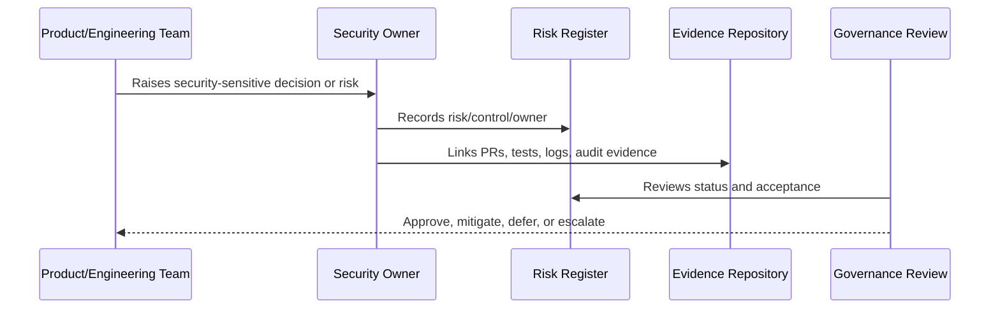

# Security Ownership and Accountability

> *"Defines ownership boundaries for security across engineering, product, operations, data, AI, integrations, support, and leadership."*

---

# Purpose

Defines ownership boundaries for security across engineering, product, operations, data, AI, integrations, support, and leadership.

---

# Governance Problem

Security gaps often happen when everyone assumes someone else owns the risk.

---

# Governance Decision

## Decision

Security ownership must be explicit, shared, and traceable; every major control area needs an owner and backup owner.

## Status

Accepted.

---

# Governance Rule

Every security governance area must be managed as:

```text
Principle -> Owner -> Control -> Evidence -> Review Cadence -> Risk Decision
```

A control is not mature unless there is:

```text
clear owner
clear implementation path
clear evidence
clear review rhythm
clear exception process
```

---

# Recommended Governance Flow



---

# Secure-by-Design Checklist

- [ ] Owner is defined.
- [ ] Backup owner is defined where needed.
- [ ] Risk is documented.
- [ ] Control is mapped to implementation.
- [ ] Evidence source is defined.
- [ ] Review cadence is defined.
- [ ] Exception path is defined.
- [ ] Escalation path is defined.
- [ ] Impact on AI/integrations/data is considered where relevant.

---

# Acceptance Criteria

- [ ] Governance responsibility is clear.
- [ ] Risk/control relationship is clear.
- [ ] Evidence expectations are clear.
- [ ] Review rhythm is clear.
- [ ] Security exceptions are handled explicitly.
- [ ] AI coding assistants can follow this safely.

---

# Anti-patterns

Avoid:

- Security ownership by assumption.
- Risk acceptance without named approver.
- Policies with no implementation controls.
- Controls with no evidence.
- Reviews with no follow-up owner.
- Audit readiness only after an audit request.
- Treating AI and integrations as normal low-risk features.
- Hiding known risks inside informal chat.

---

# Related Documents

- ../../BOOK-05-Engineering-Execution-Plan/PART-08-Security-Implementation-Plan/README.md
- ../../BOOK-05-Engineering-Execution-Plan/PART-10-DevOps-and-Release-Execution/README.md
- ../../BOOK-05-Engineering-Execution-Plan/PART-12-Production-Readiness-and-Handover/README.md
- ../../BOOK-04-Product-Domain-Specification/BOOK-04-Master-Index/BOOK-04-AI-GOVERNANCE-MAP.md
- ../../BOOK-04-Product-Domain-Specification/BOOK-04-Master-Index/BOOK-04-PERMISSION-MAP.md

---

# Navigation

**Previous:** `02-Security-Governance-Principles.md`

**Next:** `04-Security-Operating-Model.md`

---

# Ownership Areas

Assign owners for:

```text
authentication
authorization/RBAC
tenant isolation
data protection
privacy
AI governance
integration governance
incident response
security testing
dependency security
secrets management
audit logging
production readiness
```

---

# Ownership Rule

Every high-risk area needs:

```text
primary owner
backup owner
review cadence
evidence source
escalation path
```
